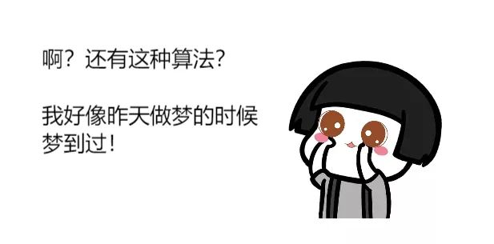
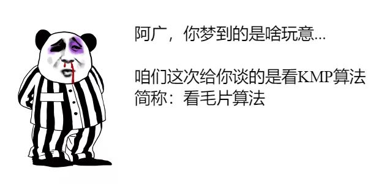
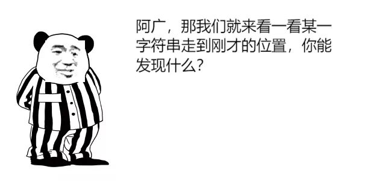
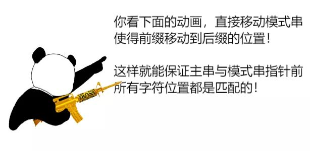
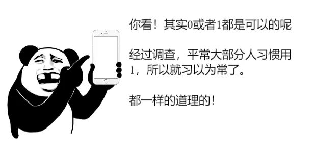

# 数据结构和算法

### KMP算法

> KMP 算法是 D.E.Knuth、J,H,Morris 和 V.R.Pratt 三位神人共同提出的，称之为 Knuth-Morria-Pratt 算法，简称 KMP 算法。该算法相对于 Brute-Force（暴力）算法有比较大的改进，主要是消除了主串指针的回溯，从而使算法效率有了某种程度的提高。

[KMP算法]: https://www.sohu.com/a/336648975_453160

所以公共前后缀的条件为：
 

1、最长的前后缀
 

2、长度小于指针前所有字符长度
 

然后移动，使得公共前缀移动到后缀的位置
 

然后继续比较！
 

**上面这个图有问题**；

- 前缀A  后缀A
- 前缀AB  后缀AA  --这里是不是可以确定公共前后缀为A啊，此时是不是可以不用再继续比较，直接移动模式串就可以了

老板我要抢答，第四位结果如下：
 

老板，我要接着抢答，第五位结果如下：
 

老板，我要再接着抢答~下面详细说一下吧，包括第六位的详细分析过程
 

先找到公共前后缀
 

也就是模式串串的第四位与主串串的当前位置作比较
 

转换结果图如下：
 

嗯！！！我终于明白了！比如模式串串1位置上发生了不匹配，则按照我们刚才定义的规则进行执行“1号位与主串串的下一位进行比较”
 

瞬间把刚才分析的图拿出来！
 

??看毛片神图
 

#### 总结

1. 模式串和主串比较
   - 如果有全字符串相同，比较完成，咱就不说这个了
2. 标记记录模式串和主串不同的位置X
3. 相同的字符串，找出模式串中找出最长（但小于模式串长度）公共的前后缀
4. 移动模式前缀串（X位置之前的串变为前缀串）
5. 再次循环以上操作，直到匹配到字符串

#### 思考原理

........CM（前）...（中间串）..CM（后）X.....

下一步CM（前）移动到 CM（后）

中间串中是否有CMX，这与前一步的比较有关

前后串的移动肯定不会超出模式串长度

模式串长度肯定小于被比较串和主串长度

所以每次移动不会超出预期长度

而上一次的比较，

### 分治算法

### 回溯算法

### DFS算法

#### 贪心算法

# 算法案例

### 八皇后游戏

### 马踏棋盘

### 汉诺塔游戏