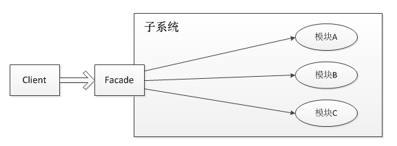

# 设计模式

| **范围**/**目的** | **创建型模式Creational**                                    | **结构型模式**                                               | **行为型模式**                                               |
| ----------------- | ----------------------------------------------------------- | ------------------------------------------------------------ | ------------------------------------------------------------ |
| **类模式**        | 工厂方法模式                                                | 适配器模式                                                   | 解释器模式<br />模板方法模式                                 |
| **对象模式**      | 抽象工厂模式<br /> 建造者模式 <br />原型模式 <br />单例模式 | 适配器模式 <br />桥接模式 <br />组合模式<br />装饰模式<br />外观模式 <br />享元模式 <br />代理模式 | 职责链模式 <br />命令模式 <br />迭代器模式 <br />中介者模式 <br />备忘录模式<br />观察者模式 <br />状态模式 <br />策略模式 <br />访问者模式 |


###  门面 /外观模式（Facade）

#### 原理

>  **外部与一个子系统的通信必须通过一个统一的外观对象进行，使得子系统更易于使用** 



#### 核心

门面模式的核心为Facade即门面对象，门面对象核心为几个点：

- 知道所有子角色的功能和责任
- 将客户端发来的请求委派到子系统中，没有实际业务逻辑
- 不参与子系统内业务逻辑的实现


#### 实例

##### slf4j日志

我们为什么要使用slf4j，举个例子：

```
我们自己的系统中使用了logback这个日志系统
我们的系统使用了A.jar，A.jar中使用的日志系统为log4j
我们的系统又使用了B.jar，B.jar中使用的日志系统为slf4j-simple

这样，我们的系统就不得不同时支持并维护logback、log4j、slf4j-simple三种日志框架，非常不便。
```

解决这个问题的方式就是引入一个适配层，由适配层决定使用哪一种日志系统，而调用端只需要做的事情就是打印日志而不需要关心如何打印日志，slf4j或者commons-logging就是这种适配层，slf4j是本文研究的对象。

从上面的描述，我们必须清楚地知道一点：**slf4j只是一个日志标准，并不是日志系统的具体实现**。理解这句话非常重要，slf4j只做两件事情：

- 提供日志接口
- 提供获取具体日志对象的方法

slf4j-simple、logback都是slf4j的具体实现，log4j并不直接实现slf4j，但是有专门的一层桥接slf4j-log4j12来实现slf4j。

为了更理解slf4j，我们先看例子，再读源码，相信读者朋友会对slf4j有更深刻的认识。


### 适配器模式（Adapter）

#### 原理

#### 实例

##### Tomcat

- 在Tomcat连接器组件中，连接器解析请求生成Request对象，而Catania容器接收ServletRequst对象，通过Adapter将Request转为ServletRequest。
- 同样的道里，将ServletResponse转为Response。


### 构建器模式（Builder）


应用场景

- 对象创建过程比较复杂，或对创建顺序或组合有依赖(经典Builder模式，可参阅GOF《设计模式》)。
- 创建对象时所需参数较多，且包含较多可选参数(变种Builder模式，可参阅《Effective Java》构建器小节)

#### 代码

```java
public class NutritionFacts {

    private final int servingSize;

    private final int servings;

    private final int calories;

    /**
    * NutritionFacts的static内部类，可以通过NutritionFacts.Builder(..)进行调用，..取决于Builder的构造器
    */
    public static class Builder {

        private final int servingSize;

        private final int servings;

        private int calories = 0;

        public Builder(int servingSize, int servings) {
            this.servingSize = servingSize;
            this.servings = servings;
        }

        /**
        * 返回Builder本身this,多个这样的方法形成流式的API
        */
        public Builder calories(int value) {
            calories = value;
            return this;
        }

        /**
        * 最终通过Builder的this对象的属性，new NutritionFacts并返回
        */
        public NutritionFacts builder() {
            return new NutritionFacts(this);
        }
    }

    /**
    * 唯一一个私有构造器，通过Builder的属性进行赋值。
    */
    private NutritionFacts(Builder builder) {
        servings = builder.servings;
        servingSize = builder.servingSize;
        calories = builder.calories;
    }
    
}
```

```java
  NutritionFacts nutritionFacts = new NutritionFacts.Builder(230,20).calories(10).builder();
```


#### 原理

- 得到一个流式的API


### 责任链模式

> 顾名思义，责任链模式（Chain of Responsibility Pattern）为请求创建了一个接收者对象的链。这种模式给予请求的类型，对请求的发送者和接收者进行解耦。这种类型的设计模式属于行为型模式。
>
> 在这种模式中，通常每个接收者都包含对另一个接收者的引用。如果一个对象不能处理该请求，那么它会把相同的请求传给下一个接收者，依此类推。

介绍

**意图：**避免请求发送者与接收者耦合在一起，让多个对象都有可能接收请求，将这些对象连接成一条链，并且沿着这条链传递请求，直到有对象处理它为止。

**主要解决：**职责链上的处理者负责处理请求，客户只需要将请求发送到职责链上即可，无须关心请求的处理细节和请求的传递，所以职责链将请求的发送者和请求的处理者解耦了。

**何时使用：**在处理消息的时候以过滤很多道。

**如何解决：**拦截的类都实现统一接口。

**关键代码：**Handler 里面聚合它自己，在 HandlerRequest 里判断是否合适，如果没达到条件则向下传递，向谁传递之前 set 进去。

**应用实例：** 1、红楼梦中的"击鼓传花"。 2、JS 中的事件冒泡。 3、JAVA WEB 中 Apache Tomcat 对 Encoding 的处理，Struts2 的拦截器，jsp servlet 的 Filter。 

**优点：** 1、降低耦合度。它将请求的发送者和接收者解耦。 2、简化了对象。使得对象不需要知道链的结构。 3、增强给对象指派职责的灵活性。通过改变链内的成员或者调动它们的次序，允许动态地新增或者删除责任。 4、增加新的请求处理类很方便。 

**缺点：** 1、不能保证请求一定被接收。 2、系统性能将受到一定影响，而且在进行代码调试时不太方便，可能会造成循环调用。 3、可能不容易观察运行时的特征，有碍于除错。 

**使用场景：** 1、有多个对象可以处理同一个请求，具体哪个对象处理该请求由运行时刻自动确定。 2、在不明确指定接收者的情况下，向多个对象中的一个提交一个请求。 3、可动态指定一组对象处理请求。 

**注意事项：**在 JAVA WEB 中遇到很多应用。


