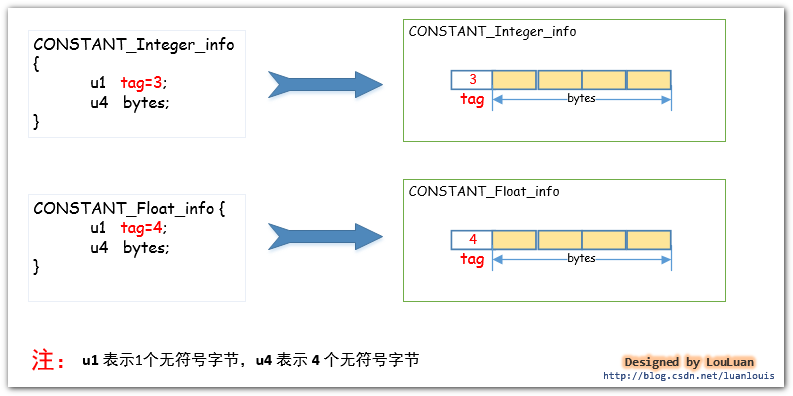
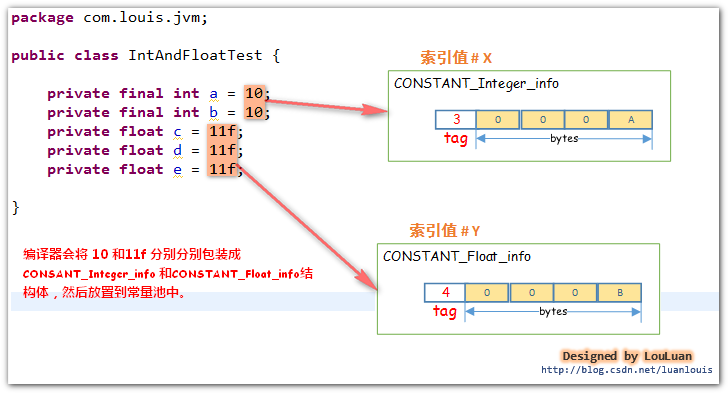
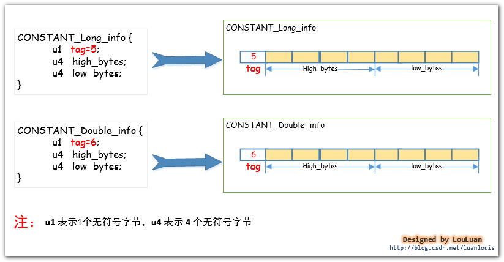

# 类文件结构


### 概述

- 计算机只认识 `0`和`1`,至今如此
- 程序编译成二进制本地机器码（Native Code），不再是唯一的选择，越来越多的程序语言选择了与操作系统和机器指令集无关的、平台中立的格式作为程序编译后的存储格式。

### 无关性基石

- 各种不同平台的Java虚拟机，以及所有平台都统一支持的程序存储格式--------字节码（Byte Code）是构成平台无关性的基石。

  - 语言无关性正在越来越被开发者重视。

  

### Class文件结构

Class文件是一组以8个字节为基础单位的二进制流，各个数据项目严格按照顺序紧凑地排列在文件中，中间没有添加任何分割符，这使得整个Class文件中存储的内容几乎全部是程序运行的必要数据，没有任何空隙存在。当遇到需要占用8个以上空间的数据项时，则会按照高位在前的方式分割成若干个8个字节进行存储。

- 无符号数：属于基本的数据类型，以u1、u2、u4、u8来分别代表1个字节、2个字节、4个字节和8个字节的无符号数，无符号数可以用来描述数组、索引引用、数量值或者按照UTF-8编码构成字符串值。
- 表:是由多个无符号数或其他表作为数据项构成的复合数据类型，为了便于区分，所有表的命名都习惯地以 `_info`结尾。表用于描述有层次关系的复合数据结构的数据，整个Class文件本质上也可以视作是一张表，这张表由下图所示的数据项按照严格顺序排列构成。

| 类型           | 名称                | 数量                    |                       |
| -------------- | ------------------- | ----------------------- | --------------------- |
| u4             | magic               | 1                       | 魔数                  |
| u2             | minor_version       | 1                       | 次版本                |
| u2             | major_version       | 1                       | 主版本                |
| u2             | constant_pool_count | 1                       | 常量池计数值，从1开始 |
| cp_info        | constant_pool       | constant_pool_count - 1 | 常量池                |
| u2             | access_flags        | 1                       | 访问标志              |
| u2             | this_class          | 1                       | 类索引                |
| u2             | super_class         | 1                       | 父类索引              |
| u2             | interfaces_count    | 1                       | 接口索引集合长度      |
| 一组u2类型集合 | interfaces          | interfaces_count        | 接口索引集合          |
| u2             | fields_count        | 1                       | 字段表集合长度        |
| field_info     | fields              | fields_count            | 字段表集合            |
| u2             | methods_count       | 1                       |                       |
| method_info    | methods             | methods_count           |                       |
| u2             | attributes_count    | 1                       |                       |
| attribute_info | attributes          | attributes_count        |                       |


#### 魔数与Class文件版本

##### magic（u4）

每个Class文件的头4个字节被称为魔数（Magic Number）。

- 唯一作用是确定这个文件是否为一个能被虚拟机接受的Class文件。

  很多文件格式标准中都有使用魔数来进行身份识别的习惯。譬如图片格式，如GIF或者JPEG等文件头中都存有魔数。

##### minor_version（u2）

次版本号

##### major(u2)

主版本号

#### 常量池

- 是Class文件结构中与其他项目关联最多的数据，通常也是占用Class文件空间最大数据项之一。
- 是Class文件中第一个出现的表类型数据项目。

##### constant_pool_count（u2）

常量池容量计数器

- 这个容量计数器是从1开始计数的，代表了常量池中的常量个数，索引值范围。
- 如果后面某些指向常量池的索引值在特定情况下需要表达“不引用任何一个常量池项目”的含义，可以把索引值设置为0来表示。
- Class文件中，只有常量池的容量计数是从1开始的，对于其他机会类型，包括接口索引集合、字段表集合、方法表集合等的容量计数都与一般习惯相同，是从0开始。

##### constant_pool（cp_info）

常量池

表结构数据

常量池中主要存放两大类常量

- 字面量(Literal)

  接近于Java语言层面的常量概念，如文本字符串、被声明为final的常量值等。

- 符号引用（Symbolic References）

  接近于编译原理方面的概念，主要包括下面几类常量：

  - 被模块导出或者开放的包（package）
  - 类和接口的全限定名（Fully Qualified Name）
  - 字段的名称和描述符（Descriptor）
  - 方法的名称和描述符
  - 方法句柄和方法类型（Method Handle、Method Type、Invoke Dynamic）
  - 动态调用点和动态常量（Dynamically-Computed Call Site、Dynamically-Computed Constant）

在Class文件中不会保存各个方法、字段最终在内存中局部信息，这些字段、方法的符号不经过虚拟机在运行期转换的话是无法得到真正的内存入口地址，也就无法直接被虚拟机使用的。当虚拟机做类加载时，将会从常量池获得对应的符号引用，再在类创建时或运行时解析、翻译到具体的内存地址中。

- 符号引用：符号引用以一组符号来描述所引用的目标，符号可以是任何形式的字面量，只要使用时能无歧义地定位到目标即可。符号引用与虚拟机实现的内存布局无关，引用的目标并不一定已经加载到了内存中。

-  直接引用：直接引用可以是直接指向目标的指针、相对偏移量或是一个能间接定位到目标的句柄。直接引用是与虚拟机实现的内存布局相关的，同一个符号引用在不同虚拟机实例上翻译出来的直接引用一般不会相同。如果有了直接引用，那说明引用的目标必定已经存在于内存之中了。


#### cp_info

常量池中每一项常量都是一个表。

所有的常量池项都具有如下通用格式： 

```c++
cp_info {
    u1 tag;
    u1 info[];
}
```

##### tag

- 常量池中表结构数据，表结构起始的第一位是个u1类型的标志位

- 代表当前常量属于那种常量类型

- 常量类型多代表的具体含义如下

  | 类型                               | 标志（tag） | 描述                           |      |
  | ---------------------------------- | ----------- | ------------------------------ | ---- |
  | `CONSTANT_Utf8_info`               | 1           | UTF-8编码的字符串              |      |
  | `CONSTANT_`Integer_info            | 3           | 整型字面量                     |      |
  | `CONSTANT_Float_info`              | 4           | 浮点型字面量                   |      |
  | `CONSTANT_Long_info`               | 5           | 长整型字面量                   |      |
  | `CONSTANT_Double_info`             | 6           | 双精度浮点型字面量             |      |
  | `CONSTANT_Class_info`              | 7           | 类或接口的符号引用             |      |
  | `CONSTANT_String_info`             | 8           | 字符串类型字面量               |      |
  | `CONSTANT_Fieldref_info`           | 9           | 字段的符号引用                 |      |
  | `CONSTANT_Methodref_info`          | 10          | 类中方法的符号引用             |      |
  | `CONSTANT_InterfaceMethodref_info` | 11          | 接口中方法符号引用             |      |
  | `CONSTANT_NameAndType_info`        | 12          | 字段或方法的部分符号引用       |      |
  | `CONSTANT_MethodHandle_info`       | 15          | 表示方法句柄                   |      |
  | `CONSTANT_MethodType_info`         | 16          | 表示方法类型                   |      |
  | `CONSTANT_Dynameic_info`           | 17          | 表示一个动态计算常量           |      |
  | `CONSTANT_InvokeDynamic_info`      | 18          | 表示一个动态方法调用点         |      |
  | `CONSTANT_Module_info`             | 19          | 表示一个模块                   |      |
  | `CONSTANT_Package_info`            | 20          | 表示一个模块中开放或者导出的包 |      |


##### CONSTANT_Class_info

结构：

| 类型 |    名称    | 数量 |
| ---- | :--------: | ---- |
| u1   |    tag     | 1    |
| u2   | name_index | 1    |

- tag

- name_index:是常量池中的索引值，它指向常量池中一个`CONSTANT_Utf8_info`类型常量，此常量代表这个类（或者接口）的全限定名。

  也就是说，再次指向常量池中的另一个`CONSTANT_utf8_info`的常量。

##### CONSTANT_Utf8_info

结构

| 类型 |  名称  | 数量   |
| ---- | :----: | ------ |
| u1   |  tag   | 1      |
| u2   | length | 1      |
| u1   | bytes  | length |

- tag

- length:说明了这个`UTF-8`编码的字符串长度是多少字节

  由于Class文件中方法、字段都需要引用`CONSTANT_Utf8_info`型常量来描述名称，所以`CONSTANT_Utf8_info`型常量的最大长度也就是Java方法、字段名的最大长度。而这里的的最大长度就是length的最大值，u2能表达的最大值65535，所以超过64k英文字符的变量名或方法名，即使规则和全面部字符都是合法的，也会无法编译。

- bytes：长度为length字节的连续数据，是一个使用了`UTF-8`缩略编码表示的字符串。

  `UTF-8缩略编码`与`UTF-8编码`的区别是：

  从`\u0001`到`\u007f`之间的字符（相当于`1-127`的ASCII码）的缩略编码使用一个字节表示

  从`\u0080`到`\u07ff`之间的所有字符（相当于128-2047`的ASCII码）的缩略编码使用两个字节表示

  从`\u0800`到`\uffff`之间的所有字符（相当于`2048-65535`的ASCII码）的缩略编码按照普通UTF-8编码规则使用三个字节表示。


常量池中的结构数据类型的结构总表


#### 访问标志(access_flags)

- `u2`,紧接在常量池结束之后

- 这个标志用于识别一些类或者接口层次的访问信息，包括：这个class是类还是接口，是否定义为public类型，是否定义为abstract类型，如果是类的话，否被声明为final等． 

- 访问标志及其含义具体如下:

  | 标志名称         | 标志值    | 含义                                                         |
  | ---------------- | --------- | ------------------------------------------------------------ |
  | `ACC_PUBLIC`     | `0x00 01` | 是否为Public类型                                             |
  | `ACC_FINAL`      | `0x00 10` | 是否被声明为final，只有类可以设置                            |
  | `ACC_SUPER`      | `0x00 20` | 是否允许使用invoke special字节码指令的新语义．               |
  | `ACC_INTERFACE`  | `0x02 00` | 标志这是一个接口                                             |
  | `ACC_ABSTRACT`   | `0x04 00` | 是否为abstract类型，对于接口或者抽象类来说，次标志值为真，其他类型为假 |
  | `ACC_SYNTHETIC`  | `0x10 00` | 标志这个类并非由用户代码产生                                 |
  | `ACC_ANNOTATION` | `0x20 00` | 标志这是一个注解                                             |
  | `ACC_ENUM`       | `0x40 00` | 标志这是一个枚举                                             |
  | `ACC_MODULE`     | `0x80 00` | 标志这是一个模块                                             |

- 以或  `|`运算符进行运算，通过标志值的或运算，可以看出哪些是定义的。

#### 类索引、父类索引与接口索引集合

Class文件中由这三项数据来确定该类型的继承关系。

类索引（this_class）：

- u2类型
  - 索引值指向类型`CONSTANT_Class_info`的类描述符常量，通过`CONSTANT_Class_info`类型的常量中索引值可以找到定义在`CONSTANT_Utf8_info`类型的常量中全限定名字字符串。
- 用于确定这个类的全限定名

父类索引（super_class）

- u2类型
  - 索引值指向类型`CONSTANT_Class_info`的类描述符常量，通过`CONSTANT_Class_info`类型的常量中索引值可以找到定义在`CONSTANT_Utf8_info`类型的常量中全限定名字字符串。
- 用于确定这个类的的父类全限定名，JAVA不允许多重继承，索引父类索引只有一个。除了`java.lang.Object`之外，所有Java类的父类索引都不为0


接口索引集合（interfaces）

- 一组u2类型的数据集合
- 用来描述这个类实现了哪些接口，这些接口按`implements`关键字（如果这个Class文件中表示的是一个接口，则应当是`extends`关键字）后的接口顺序从左到右排列在接口索引集合中。

#### 字段表集合

- 字段表结构

  | 类型           | 名称             | 数量             |              |
  | -------------- | ---------------- | ---------------- | ------------ |
  | ｕ2            | access_flags     | 1                | 字段访问标志 |
  | ｕ2            | name_index       | 1                |              |
  | ｕ2            | descriptor_index | 1                |              |
  | ｕ2            | attributes_count | 1                |              |
  | attribute_info | attributes       | attributes_count |              |

- 字段访问标志

  | 标志名称      | 标志值  | 含义                       |
  | ------------- | ------- | -------------------------- |
  | ACC_PUBLIC    | 0x00 01 | 字段是否为public           |
  | ACC_PRIVATE   | 0x00 02 | 字段是否为private          |
  | ACC_PROTECTED | 0x00 04 | 字段是否为protected        |
  | ACC_STATIC    | 0x00 08 | 字段是否为static           |
  | ACC_FINAL     | 0x00 10 | 字段是否为final            |
  | ACC_VOLATILE  | 0x00 40 | 字段是否为volatile         |
  | ACC_TRANSTENT | 0x00 80 | 字段是否为transient        |
  | ACC_SYNCHETIC | 0x10 00 | 字段是否为由编译器自动产生 |
  | ACC_ENUM      | 0x40 00 | 字段是否为enum             |

- name_index和descriptior_index

  字段的简单名称以及字段和方法的描述符。

  描述符的作用是用来描述字段的数据类型，方法的参数列表（包括数量，类型以及顺序）和返回值．根据描述符规则，基本数据类型以及代表无返回值的void类型都用一个大写字符来表示，而对象类型则用字符加L加对象名的全限定名来表示． 

   描述符标志含义： 

  | 标志符 | 含义                |
  | ------ | ------------------- |
  | B      | 基本数据类型byte    |
  | C      | 基本数据类型char    |
  | D      | 基本数据类型double  |
  | F      | 基本数据类型float   |
  | I      | 基本数据类型int     |
  | J      | 基本数据类型long    |
  | S      | 基本数据类型short   |
  | Z      | 基本数据类型boolean |
  | V      | 基本数据类型void    |
  | L      | 对象类型            |

  对于数组类型，每一维度将使用一个前置的＂［＂字符来描述．如一个定义为＂java.lang.Stirng[ ]＂类型的二维数组，将被记录为：＂［［Ljava/lang/Stirng＂，一个整型数组＂int［］＂将被记录为＂［I＂． 

  用描述符来描述方法时，按照先参数列表，后返回值的顺序来描述，参数列表按照参数的严格顺序放在一组小括号＂（）＂之内． 

  字段表集合中不会列出从父类或者父接口中继承而来的字段，但有可能列出原来Java代码中不存在的字段，譬如在内部类中为了保持对外部类的访问性，会自动添加指向外部类实例的字段．另外，在Java语言中字段是无法重载的，两个字段的数据类型，修饰符不管是否相同，都必须使用不一样的名称，但是对于字节码来讲，如果连个字段的描述符不一致，那字段重名就是合法的． 


# Class文件中的常量池详解

[Class文件中的常量池详解]: https://blog.csdn.net/wangtaomtk/article/details/52267548


####  NO1.**常量池在class文件的什么位置？**

​      我的上一篇文章《Java虚拟机原理图解》 1、class文件基本组织结构中已经提到了class的文件结构，在class文件中的魔数、副版本号、主版本之后，紧接着就是常量池的数据区域了，如下图用红线包括的位置：

  

   知道了常量池的位置后，然后让我们来揭秘常量池里究竟有什么东西吧～   

####  NO2.**常量池的里面是怎么组织的？**

​    常量池的组织很简单，前端的两个字节占有的位置叫做**常量池计数器**(**constant_pool_count**)，它记录着常量池的组成元素 **常量池项(cp_info)**的个数。紧接着会排列着**constant_pool_count-1**个**常量池项(cp_info)**。如下图所示

  

 

####  NO3.**常量池项 (cp_info) 的结构是什么？**

  每个**常量池项(cp_info)** 都会对应记录着class文件中的某中类型的字面量。让我们先来了解一下**常量池项(cp_info)**的结构吧：

(错误，所有的cp_info项都是表结构数据；所以

cp_info{

info[]

}


info{

​	u1  tag;

}

   

  


 JVM虚拟机规定了不同的tag值和不同类型的字面量对应关系如下：

   

​      所以根据cp_info中的tag 不同的值，可以将cp_info 更细化为以下结构体：

​       **CONSTANT_Utf8_info,CONSTANT_Integer_info,CONSTANT_Float_info,CONSTANT_Long_info,
​       CONSTANT_Double_info,CONSTANT_Class_info,CONSTANT_String_info,CONSTANT_Fieldref_info,
​       CONSTANT_Methodref_info,CONSTANT_InterfaceMethodref_info,CONSTANT_NameAndType_info,CONSTANT_MethodHandle_info,
​       CONSTANT_MethodType_info,CONSTANT_InvokeDynamic_info**。

​      

​       现在让我们看一下细化了的常量池的结构会是类似下图所示的样子：

​         
​      

####  NO4.**常量池能够表示那些信息？**

 

 

####  NO5. **int和float数据类型的常量**在常量池中是怎样表示和存储的？(CONSTANT_Integer_info, CONSTANT_Float_info) 

 Java语言规范规定了 int类型和Float 类型的数据类型占用 **4** 个字节的空间。那么存在于class字节码文件中的该类型的常量是如何存储的呢？相应地，在常量池中，将 int和Float类型的常量分别使用CONSTANT_Integer_info和 Constant_float_info表示，他们的结构如下所示：

 

 举例：建下面的类 IntAndFloatTest.java，在这个类中，我们声明了五个变量，但是取值就两种int类型的**10** 和Float类型的**11f**。


```java
package com.louis.jvm;  

 public class IntAndFloatTest { 

 	private final int a = 10; 

  	private final int  b = 10; 

	private float c = 11f; 

	private floatd = 11f; 

   	private float e = 11f; 

 } 
```


 


 然后用编译器编译成IntAndFloatTest.class字节码文件，我们通过**javap -v IntAndFloatTest** 指令来看一下其常量池中的信息，可以看到虽然我们在代码中写了两次**10** 和三次**11f**，但是常量池中，就只有一个常量**10** 和一个常量**11f**,如下图所示:

 

 从结果上可以看到常量池第**#8** 个**常量池项(cp_info)** 就是CONSTANT_Integer_info,值为**10**；第**#23**个**常量池项(cp_info)** 就是CONSTANT_Float_info,值为**11f**。(*常量池中其他的东西先别纠结啦，我们会面会一一讲解的哦*)。

 代码中所有用到 int 类型 **10** 的地方，会使用指向常量池的指针值**#8** 定位到第**#8** 个**常量池项(cp_info)，**即值为 **10**的结构体CONSTANT_Integer_info，而用到float类型的**11f**时，也会指向常量池的指针值#23来定位到第#23个**常量池项(cp_info)** 即值为**11f**的结构体CONSTANT_Float_info。如下图所示：

 

 

####  NO6. **long和 double数据类型的常量**在常量池中是怎样表示和存储的？(CONSTANT_Long_info、CONSTANT_Double_info )

 Java语言规范规定了 **long** 类型和 **double**类型的数据类型占用**8** 个字节的空间。那么存在于class 字节码文件中的该类型的常量是如何存储的呢？相应地，在常量池中，将**long**和**double**类型的常量分别使用CONSTANT_Long_info和Constant_Double_info表示，他们的结构如下所示：

 

   举例：建下面的类 LongAndDoubleTest.java，在这个类中，我们声明了六个变量，但是取值就两种**Long** 类型的**-6076574518398440533L** 和**Double** 类型的**10.1234567890D**。

**[java]**[view  plain](http://blog.csdn.net/luanlouis/article/details/39960815#)

 

 [](https://code.csdn.net/snippets/486009)

1.  **package** com.louis.jvm; 
2.   
3.  **public** **class** LongAndDoubleTest { 
4. ​    
5.    **private** **long** a = -6076574518398440533L; 
6.    **private** **long** b = -6076574518398440533L; 
7.    **private** **long** c = -6076574518398440533L; 
8.    **private** **double** d = 10.1234567890D; 
9.    **private** **double** e = 10.1234567890D; 
10.    **private** **double** f = 10.1234567890D; 
11.  } 

 


   然后用编译器编译成 LongAndDoubleTest.class 字节码文件，我们通过**javap -v LongAndDoubleTest**指令来看一下其常量池中的信息，可以看到虽然我们在代码中写了三次**-6076574518398440533L** 和三次**10.1234567890D**，但是常量池中，就只有一个常量**-6076574518398440533L** 和一个常量**10.1234567890D**,如下图所示:

 

​    从结果上可以看到常量池第 **#18** 个**常量池项(cp_info)** 就是**CONSTANT_Long_info**,值为**-6076574518398440533L** ；第 **#26**个**常量池项(cp_info)** 就是**CONSTANT_Double_info**,值为**10.1234567890D**。(常量池中其他的东西先别纠结啦，我们会面会一一讲解的哦)。

​    代码中所有用到 long 类型**-6076574518398440533L** 的地方，会使用指向常量池的指针值**#18** 定位到第 **#18** 个**常量池项(cp_info)，**即值为**-6076574518398440533L** 的结构体**CONSTANT_Long_info**，而用到double类型的**10.1234567890D**时，也会指向常量池的指针值**#26**来定位到第 **#26** 个**常量池项(cp_info)** 即值为**10.1234567890D**的结构体**CONSTANT_Double_info**。如下图所示：

 

 

####  NO7. **String类型的字符串常量**在常量池中是怎样表示和存储的？（CONSTANT_String_info、CONSTANT_Utf8_info）

​    对于字符串而言，JVM会将字符串类型的字面量以UTF-8 编码格式存储到在class字节码文件中。这么说可能有点摸不着北，我们先从直观的Java源码中中出现的用双引号"" 括起来的字符串来看，在编译器编译的时候，都会将这些字符串转换成**CONSTANT_String_info**结构体，然后放置于常量池中。其结构如下所示：

 

   如上图所示的结构体，**CONSTANT_String_info**结构体中的string_index的值指向了CONSTANT_Utf8_info结构体，而字符串的utf-8编码数据就在这个结构体之中。如下图所示：

 

 请看一例，定义一个简单的StringTest.java类，然后在这个类里加一个"JVM原理" 字符串，然后，我们来看看它在class文件中是怎样组织的。

**[java]**[view  plain](http://blog.csdn.net/luanlouis/article/details/39960815#)

 

 [](https://code.csdn.net/snippets/486009)

1.  **package** com.louis.jvm; 
2.   
3.  **public** **class** StringTest { 
4.    **private** String s1 = "JVM原理"; 
5.    **private** String s2 = "JVM原理"; 
6.    **private** String s3 = "JVM原理"; 
7.    **private** String s4 = "JVM原理"; 
8.  } 

 将Java源码编译成StringTest.class文件后，在此文件的目录下执行 javap -v StringTest 命令，会看到如下的常量池信息的轮廓：

 

 (PS :使用javap -v 指令能看到易于我们阅读的信息，查看真正的字节码文件可以使用HEXWin、NOTEPAD++、UtraEdit 等工具。)

​    在面的图中，我们可以看到**CONSTANT_String_info**结构体位于常量池的第**#15**个索引位置。而存放"Java虚拟机原理" 字符串的 UTF-8编码格式的字节数组被放到**CONSTANT_Utf8_info**结构体中，该结构体位于常量池的第**#16**个索引位置。上面的图只是看了个轮廓，让我们再深入地看一下它们的组织吧。请看下图：

 

 由上图可见：“**JVM原理**”的UTF-8编码的数组是：4A564D E5 8E 9FE7 90 86，并且存入了**CONSTANT_Utf8_info**结构体中。

  

####  NO8. **类文件中定义的类名和类中使用到的类**在常量池中是怎样被组织和存储的？(CONSTANT_Class_info)

   JVM会将某个Java 类中所有使用到了的**类的完全限定名** 以**二进制形式的完全限定名** 封装成**CONSTANT_Class_info**结构体中，然后将其放置到常量池里。**CONSTANT_Class_info** 的tag值为 **7 。**其结构如下：

     

> Tips：**类的完全限定名**和**二进制形式的完全限定名**
>
> ​    在某个Java源码中，我们会使用很多个类，比如我们定义了一个 **ClassTest**的类，并把它放到**com.louis.jvm** 包下，则 **ClassTest**类的完全限定名为**com.louis.jvm.ClassTest**，将JVM编译器将类编译成class文件后，此完全限定名在class文件中，是以二进制形式的完全限定名存储的，即它会把完全限定符的"**.**"换成**"\*/\*"** ，即在class文件中存储的 **ClassTest**类的完全限定名称是"**com/louis/jvm/ClassTest**"。因为这种形式的完全限定名是放在了class二进制形式的字节码文件中，所以就称之为 **二进制形式的完全限定名。**

 举例，我们定义一个很简单的**ClassTest**类，来看一下常量池是怎么对类的完全限定名进行存储的。

**[java]**[view  plain](http://blog.csdn.net/luanlouis/article/details/39960815#)

 

 [](https://code.csdn.net/snippets/486009)

1.  **package** com.jvm; 
2.  **import** java.util.Date; 
3.  **public** **class** ClassTest { 
4.    **private** Date date =**new** Date(); 
5.  } 

 将Java源码编译成**ClassTest.class**文件后，在此文件的目录下执行 javap -v ClassTest 命令，会看到如下的常量池信息的轮廓：

 

 如上图所示，在**ClassTest.class**文件的常量池中，共有 3 个**CONSTANT_Class_info**结构体，分别表示**ClassTest** 中用到的Class信息。 我们就看其中一个表示**com/jvm.ClassTest**的**CONSTANT_Class_info** 结构体。它在常量池中的位置是**#1**，它的name_index值为**#2**，它指向了常量池的第***2*** 个常量池项，如下所示:

 

**注意：**

   对于某个类而言，其class文件中至少要有两个CONSTANT_Class_info常量池项，用来表示自己的类信息和其父类信息。(除了java.lang.Object类除外，其他的任何类都会默认继承自java.lang.Object）如果类声明实现了某些接口，那么接口的信息也会生成对应的CONSTANT_Class_info常量池项。

  除此之外，如果在类中使用到了其他的类，只有真正使用到了相应的类，JDK编译器才会将类的信息组成CONSTANT_Class_info常量池项放置到常量池中。如下图：

**[java]**[view  plain](http://blog.csdn.net/luanlouis/article/details/39960815#)

 

 

1.  **package** com.louis.jvm; 
2.   
3.  **import** java.util.Date; 
4.   
5.  **public** **class** Other{ 
6.    **private** Date date; 
7. ​    
8.    **public** Other() 
9.    { 
10. ​     Date da; 
11.    } 
12.  } 

上述的Other的类，在JDK将其编译成class文件时，常量池中并没有java.util.Date对应的CONSTANT_Class_info常量池项，为什么呢?

  在Other类中虽然定义了Date类型的两个变量date、da，但是JDK编译的时候，认为你只是声明了“Ljava/util/Date”类型的变量，并没有实际使用到Ljava/util/Date类。将类信息放置到常量池中的目的，是为了在后续的代码中有可能会反复用到它。很显然，JDK在编译Other类的时候，会解析到Date类有没有用到，发现该类在代码中就没有用到过，所以就认为没有必要将它的信息放置到常量池中了。

  将上述的Other类改写一下，仅使用new Date()，如下图所示：

 

**[java]**[view  plain](http://blog.csdn.net/luanlouis/article/details/39960815#)

 

 

1.  **package** com.louis.jvm; 
2.   
3.  **import** java.util.Date; 
4.   
5.  **public** **class** Other{ 
6.    **public** Other() 
7.    { 
8. ​     **new** Date(); 
9.    } 
10.  } 


  这时候使用javap -v Other ，可以查看到常量池中有表示java/util/Date的常量池项： 

 

 

  总结：

​    1.  对于某个类或接口而言，其自身、父类和继承或实现的接口的信息会被直接组装成CONSTANT_Class_info常量池项放置到常量池中； 

​    2.  类中或接口中使用到了其他的类，只有在类中实际使用到了该类时，该类的信息才会在常量池中有对应的CONSTANT_Class_info常量池项；

​    3.  类中或接口中仅仅定义某种类型的变量，JDK只会将变量的类型描述信息以UTF-8字符串组成CONSTANT_Utf8_info常量池项放置到常量池中，上面在类中的private Date date;JDK编译器只会将表示date的数据类型的“Ljava/util/Date”字符串放置到常量池中。


