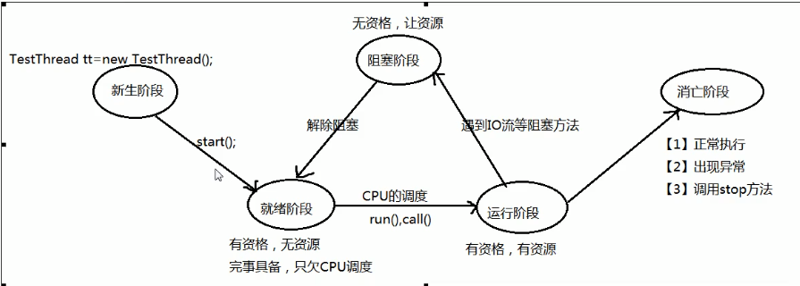
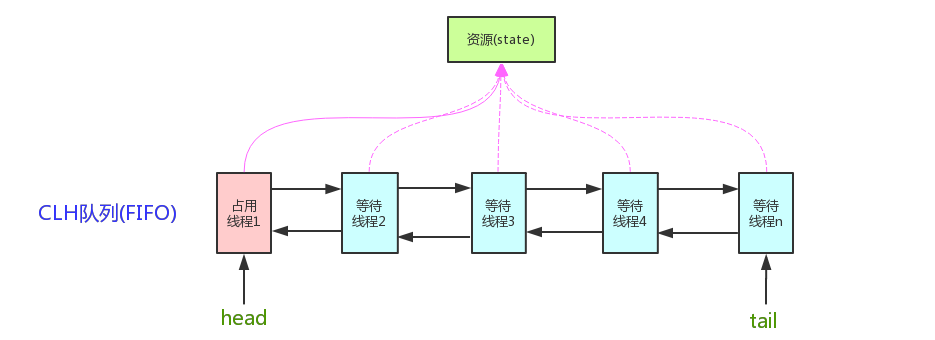
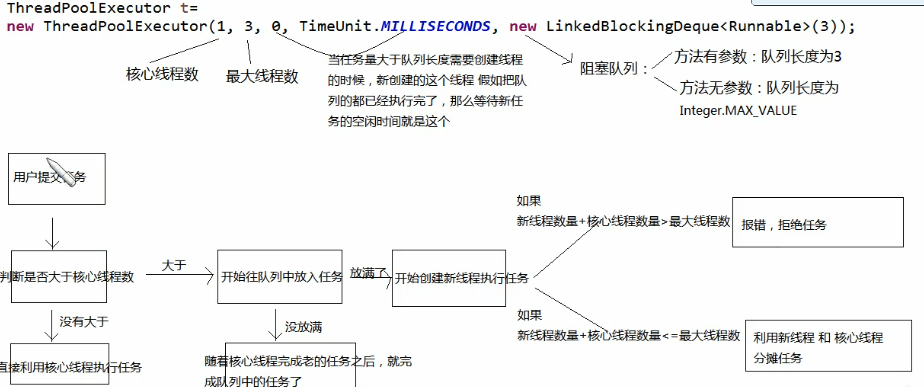

# JUC（java.util.concurrent）并发

并发：同一时刻，只能处理一个任务，但一个时间段内可以对多个任务交替处理

并行：同一时刻，可以处理多个任务


## 线程的生命周期



## 多线程

### 上联：线程  操作  资源类

### 下联：判断  干活  通知

- this.wait() or  not wait()   ----wait()匹配的是synchronized
- do something
- this.notifyAll() 唤醒通知，这里注意虚假唤醒

### 注意：警惕虚假唤醒

多线程横向调用要用while()


```text
举例：
	一群人，坐飞机，过安检（判断），坐上飞机后，接到消息通知，飞机停飞，同志们都下了飞机，刚下飞机，迈出一步，接到通知，飞机可以准时起飞（刚才的消息是虚假通知）。
	问:这个时候再次登机，需不需要再次过安检（再次判断）。
	答:必须需要再次过安检。
	判断wait(),notifyAll()通知这种机制必须用while，苏醒之后必须拉回来重新判断;
	
```

```text
public final void wait()
                throws InterruptedException

导致当前线程等待，直到另一个线程调用该对象的notify()方法或notifyAll()方法。 换句话说，这个方法的行为就好像简单地执行呼叫wait(0) 。

当前的线程必须拥有该对象的显示器。 该线程释放此监视器的所有权，并等待另一个线程通知等待该对象监视器的线程通过调用notify方法或notifyAll方法notifyAll 。 然后线程等待，直到它可以重新获得监视器的所有权并恢复执行。

像在一个参数版本中，中断和虚假唤醒是可能的，并且该方法应该始终在循环中使用：

  synchronized (obj) {
         while (<condition does not hold>)
             obj.wait();
         ... // Perform action appropriate to condition
     } 

该方法只能由作为该对象的监视器的所有者的线程调用。
```


[java.util.concurrent](http://www.matools.com/file/manual/jdk_api_1.8_google/java/util/concurrent/package-frame.html)

[java.util.concurrent.atomic](http://www.matools.com/file/manual/jdk_api_1.8_google/java/util/concurrent/atomic/package-frame.html)

[java.util.concurrent.locks](http://www.matools.com/file/manual/jdk_api_1.8_google/java/util/concurrent/locks/package-frame.html)


##### 线程的状态

```java
public static enum Thread.State
extends Enum<Thread.State>{
    
}
```

线程状态。线程可以处于以下状态之一：

-  [`NEW`](http://www.matools.com/file/manual/jdk_api_1.8_google/java/lang/Thread.State.html#NEW) 
   尚未启动的线程处于此状态。 
-  [`RUNNABLE`](http://www.matools.com/file/manual/jdk_api_1.8_google/java/lang/Thread.State.html#RUNNABLE) 
   在Java虚拟机中执行的线程处于此状态。 
-  [`BLOCKED`](http://www.matools.com/file/manual/jdk_api_1.8_google/java/lang/Thread.State.html#BLOCKED) 
   被阻塞等待监视器锁定的线程处于此状态。 
-  [`WAITING`](http://www.matools.com/file/manual/jdk_api_1.8_google/java/lang/Thread.State.html#WAITING) 
   正在等待另一个线程执行特定动作的线程处于此状态。 
-  [`TIMED_WAITING`](http://www.matools.com/file/manual/jdk_api_1.8_google/java/lang/Thread.State.html#TIMED_WAITING) 
   正在等待另一个线程执行动作达到指定等待时间的线程处于此状态。 
-  [`TERMINATED`](http://www.matools.com/file/manual/jdk_api_1.8_google/java/lang/Thread.State.html#TERMINATED) 
   已退出的线程处于此状态。 

##### 实例

```java

class Ticket {

    private int number = 30;

    Lock lock = new ReentrantLock();//锁解接口  可重复锁的实现类  

    public void sale() {
        lock.lock();//加锁
        try {
            if (number > 0) {
                System.out.println(Thread.currentThread().getName() + "卖票第" + (number--) + "张票;剩余:" + number);
            }
        } catch (Exception e) {
            e.printStackTrace();
        } finally {
            lock.unlock();//释放锁
        }

    }

}

public class App {
    
    public static void main(String[] args) {
        Ticket ticket = new Ticket();

        new Thread(() -> {
            for (int i = 0; i < 50; i++) {
                ticket.sale();
            }
        }, "A").start();//别忘了start启动线程
        new Thread(() -> {
            for (int i = 0; i < 50; i++) {
                ticket.sale();
            }
        }, "B").start();
        new Thread(() -> {
            for (int i = 0; i < 50; i++) {
                ticket.sale();
            }
        }, "C").start();

    }

}
```


## 锁

synchronized 

- synchronized 写在方法上，但作用到类上
- synchronized 在非静态方法上，作用的是new 的对象 synchronized（this）
- synchronized 在静态方法上，作用的是该类的Class对象（全局锁）

### 公平锁/非公平锁

- 公平锁是指多个线程按照申请锁的顺序来获取锁。

- 非公平锁是指多个线程获取锁的顺序并不是按照申请锁的顺序，有可能后申请的线程比先申请的线程优先获取锁。有可能，会造成优先级反转或者饥饿现象。

  > 对于Java `ReentrantLock`而言，通过构造函数指定该锁是否是公平锁，默认是非公平锁。非公平锁的优点在于吞吐量比公平锁大。
  > 对于`Synchronized`而言，也是一种非公平锁。由于其并不像`ReentrantLock`是通过AQS的来实现线程调度，所以并没有任何办法使其变成公平锁。

### 可重入锁

可重入锁又名递归锁，是指在同一个线程在外层方法获取锁的时候，在进入内层方法会自动获取锁。

> 对于Java `ReentrantLock`而言, 他的名字就可以看出是一个可重入锁，其名字是`Re entrant Lock`重新进入锁。
> 对于`Synchronized`而言,也是一个可重入锁。可重入锁的一个好处是可一定程度避免死锁。

```java
synchronized void setA() throws Exception{
	Thread.sleep(1000);
	setB();
}

synchronized void setB() throws Exception{
	Thread.sleep(1000);
}
```

上面的代码就是一个可重入锁的一个特点，如果不是可重入锁的话，setB可能不会被当前线程执行，可能造成死锁。

### 独享锁/共享锁

- 独享锁是指该锁一次只能被一个线程所持有。
- 共享锁是指该锁可被多个线程所持有。

> 对于Java `ReentrantLock`而言，其是独享锁。但是对于Lock的另一个实现类`ReadWriteLock`，其读锁是共享锁，其写锁是独享锁。
> 读锁的共享锁可保证并发读是非常高效的，读写，写读 ，写写的过程是互斥的。
> 独享锁与共享锁也是通过AQS来实现的，通过实现不同的方法，来实现独享或者共享。
> 对于`Synchronized`而言，当然是独享锁。

### 互斥锁/读写锁

上面讲的独享锁/共享锁就是一种广义的说法，互斥锁/读写锁就是具体的实现。
互斥锁在Java中的具体实现就是`ReentrantLock`
读写锁在Java中的具体实现就是`ReadWriteLock`

### 乐观锁/悲观锁

乐观锁与悲观锁不是指具体的什么类型的锁，而是指看待并发同步的角度。

- 悲观锁认为对于同一个数据的并发操作，一定是会发生修改的，哪怕没有修改，也会认为修改。因此对于同一个数据的并发操作，悲观锁采取加锁的形式。悲观的认为，不加锁的并发操作一定会出问题。
- 乐观锁则认为对于同一个数据的并发操作，是不会发生修改的。在更新数据的时候，会采用尝试更新，不断重新的方式更新数据。乐观的认为，不加锁的并发操作是没有事情的。

从上面的描述我们可以看出，悲观锁适合写操作非常多的场景，乐观锁适合读操作非常多的场景，不加锁会带来大量的性能提升。

> 悲观锁在Java中的使用，就是利用各种锁。
> 乐观锁在Java中的使用，是无锁编程，常常采用的是CAS算法，典型的例子就是原子类，通过CAS自旋实现原子操作的更新。

### 分段锁

- 分段锁其实是一种锁的设计，并不是具体的一种锁，对于`ConcurrentHashMap`而言，其并发的实现就是通过分段锁的形式来实现高效的并发操作。

我们以`ConcurrentHashMap`来说一下分段锁的含义以及设计思想，`ConcurrentHashMap`中的分段锁称为Segment，它即类似于HashMap（JDK7与JDK8中HashMap的实现）的结构，即内部拥有一个Entry数组，数组中的每个元素又是一个链表；同时又是一个ReentrantLock（Segment继承了ReentrantLock)。
当需要put元素的时候，并不是对整个hashmap进行加锁，而是先通过hashcode来知道他要放在那一个分段中，然后对这个分段进行加锁，所以当多线程put的时候，只要不是放在一个分段中，就实现了真正的并行的插入。
但是，在统计size的时候，可就是获取hashmap全局信息的时候，就需要获取所有的分段锁才能统计。
分段锁的设计目的是细化锁的粒度，当操作不需要更新整个数组的时候，就仅仅针对数组中的一项进行加锁操作。

### 偏向锁/轻量级锁/重量级锁

这三种锁是指锁的状态，并且是针对`Synchronized`。在Java 5通过引入锁升级的机制来实现高效`Synchronized`。这三种锁的状态是通过对象监视器在对象头中的字段来表明的。
偏向锁是指一段同步代码一直被一个线程所访问，那么该线程会自动获取锁。降低获取锁的代价。
轻量级锁是指当锁是偏向锁的时候，被另一个线程所访问，偏向锁就会升级为轻量级锁，其他线程会通过自旋的形式尝试获取锁，不会阻塞，提高性能。
重量级锁是指当锁为轻量级锁的时候，另一个线程虽然是自旋，但自旋不会一直持续下去，当自旋一定次数的时候，还没有获取到锁，就会进入阻塞，该锁膨胀为重量级锁。重量级锁会让其他申请的线程进入阻塞，性能降低。

### 自旋锁

在Java中，自旋锁是指尝试获取锁的线程不会立即阻塞，而是采用循环的方式去尝试获取锁，这样的好处是减少线程上下文切换的消耗，缺点是循环会消耗CPU。

### AbstractQueuedSynchronizer（AQS）

[AQS]: https://www.cnblogs.com/waterystone/p/4920797.html	"AQS"

抽象的队列式的同步器



#### FIFO

FIFO:First In First Out(先入先出队列)

一种先进先出的数据缓存器，他与普通存储器的区别是没有外部读写地址线，这样使用起来非常简单，但缺点就是只能顺序写入数据，顺序的读出数据，其数据地址由内部读写指针自动加1完成，不能像普通存储器那样可以由地址线决定读取或写入某个指定的地址。

#### State

它维护了一个volatile int state（代表共享资源）和一个FIFO线程等待队列（多线程争用资源被阻塞时会进入此队列）。state的访问方式有三种:

- getState()
- setState()
- compareAndSetState()

#### 共享方式

AQS定义两种资源共享方式：Exclusive（独占，只有一个线程能执行，如ReentrantLock）和Share（共享，多个线程可同时执行，如Semaphore/CountDownLatch）

#### 同步器

不同的自定义同步器争用共享资源的方式也不同。**自定义同步器在实现时只需要实现共享资源state的获取与释放方式即可**，至于具体线程等待队列的维护（如获取资源失败入队/唤醒出队等），AQS已经在顶层实现好了。自定义同步器实现时主要实现以下几种方法：

- isHeldExclusively()：该线程是否正在独占资源。只有用到condition才需要去实现它。
- tryAcquire(int)：独占方式。尝试获取资源，成功则返回true，失败则返回false。
- tryRelease(int)：独占方式。尝试释放资源，成功则返回true，失败则返回false。
- tryAcquireShared(int)：共享方式。尝试获取资源。负数表示失败；0表示成功，但没有剩余可用资源；正数表示成功，且有剩余资源。
- tryReleaseShared(int)：共享方式。尝试释放资源，如果释放后允许唤醒后续等待结点返回true，否则返回false。


### lock

### ReentrantLock

```
Condition condition = lock.newCondition();		
condition.await();====wait()
condition.signalAll(); notifyAll()

```

### 精确唤醒

- 利用lock已经Condition

- 一把锁lock，多个钥匙condition

  1. 一把锁

     - Lock lock = new ReentrantLock();

  2. 多个钥匙

     - Condition c1 = lock.newCondition();
     - Condition c2 = lock.newCondition();
     - Condition c3 = lock.newCondition();

  3. 线程标记位

     - int num = 1;

  4. 指定钥匙被唤醒

     - c2.signal（）；

     - ```java
       class ShareDate {   
           private Lock lock = new ReentrantLock(); 
           private int num = 1;    
           private Condition c1 = lock.newCondition();
           private Condition c2 = lock.newCondition();  
           private Condition c3 = lock.newCondition();   
           private void service() {       
               lock.lock();       
               try {          
                   while (num != 1) {  
                       c1.await();          
                   }            
                   //todo service        
                   for (int i = 0; i < 10; i++) {                
                       System.out.println(Thread.currentThread().getName() + "\t" + i);     
                   }           
                   num = 2;          
                   c2.signal(); //指定钥匙插入   
               }
               catch (Exception e) { 
               } finally {          
                   lock.unlock();       
               }    
           }
       }
       ```


## 

## 线程池

线程池用的是阻塞队列

### ThreadPoolExecutor



### 并发队列


#### ConcurrentLinkedQueue

队列：先进先出

- 阻塞队列

  - 入队

  当队列容器满了，向队列再添加数据时，数据等待（等待容器可以放入，即：队列容器有数据被取出时）

  - 出队

  如果队列中没有元素，取数据，等待，什么时候放入数据，就取出放入的数据

- 非阻塞队列

  - 入队

  当队列容器满了，向队列再添加数据时，数据丢失

  - 出队

  如果队列中没有元素，取数据，取出null


### Callable

### FutureTask

