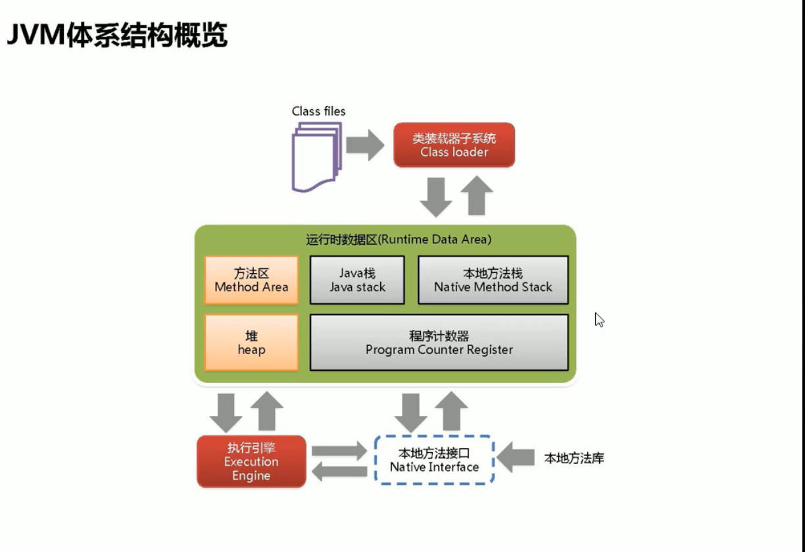

# JVM

## 概览

### 方法区Method Area

- 存放类的描述信息
- 也就是类的模板，即： XXX Class

## 类装载器ClassLoader

- 负责加载class文件(只是快递员)
  - class文件在文件开头有特定的文件标示（cafe babe）
  - 将class文件字节码内容加载到内存中
  - 并将内容转换成方法去中的运行时数据结构
  - ClassLoader**只负责class文件的加载**，至于它是否可以运行，由Execution Engine决定
  - 
  - 

### 双亲委派

- 在最顶端查找Class
- 我爸是李刚，有事找我爸
- 优先加载java自己的Class  rt.jar (running time .jar)，加载到之后不在管后面的。
- 

### 沙箱安全

- 防止恶意代码去污染

## 本地接口

### 作用

融合不同的编程语言为Java所用，初衷是融合C/C++程序，Java诞生的时候是C/C++横行的时候，想要立足，必须有调用C/C++程序，于是就在内存中专门开辟了一块区域处理标记为native方法，在Execution Engine执行是加载native libraies。

目前该方法使用的越来越少，除非是与硬件有关的应用。