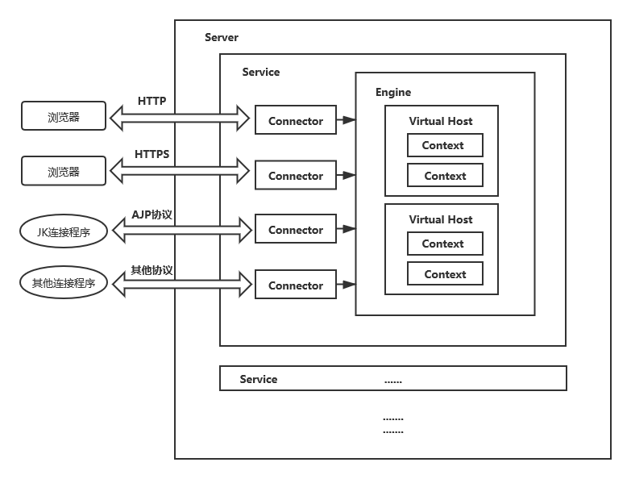
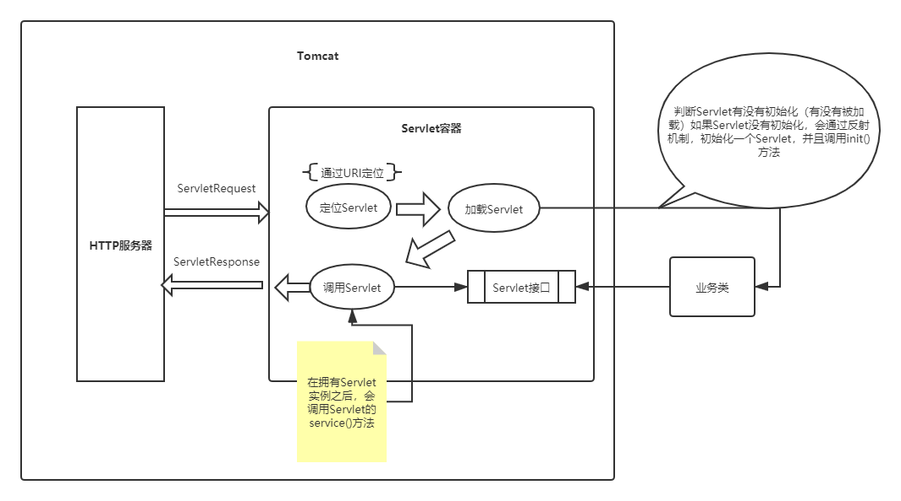
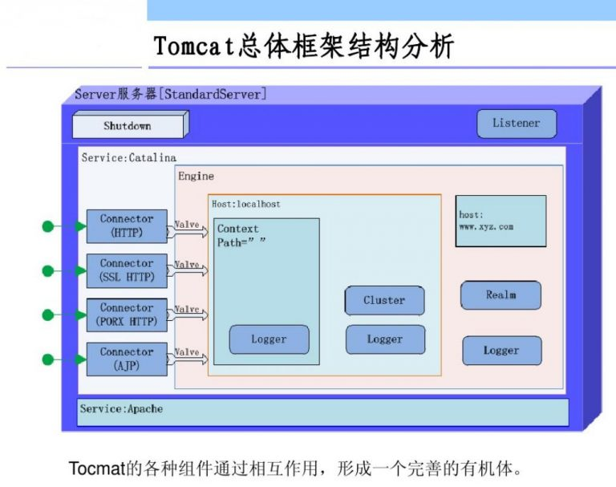
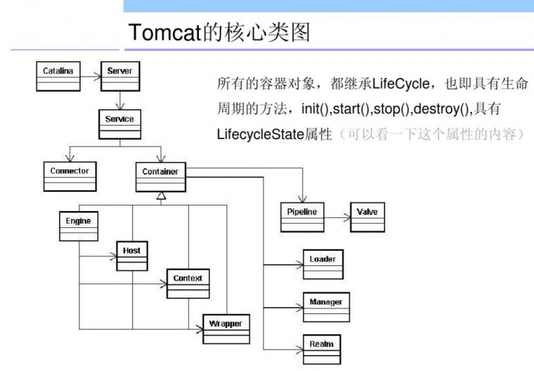

## Tomcat体系架构










### 架构讲解

####  Server

- 代表整个服务器（Server表示整个的Catalina Servlet容器）
- Tomcat提供了Server接口的一个默认实现，这通常不需要用户自己去实现
- 在Server容器中，可以包含**一个或多个Service组件**  

####  **Service** 

- Service是存活在Server内部的中间组件，它将**一个或多个连接器（Connector）组件绑定到一个单独的引擎（Engine）上**
- 在Server中，可以包含一个或多个Service组件。Service也很少由用户定制，Tomcat提供了Service接口的默认实现，而这种实现既简单又能满足应用
- 负责处理所有Connector所获得的客户请求 

#### Connector（连接器）

- 连接器（Connector）处理与客户端的通信，它负责接收客户请求，以及向客户返回响应结果（ 一个Connector将在某个指定端口上侦听客户请求，并将获得的请求交给Engine来处理，从Engine处获得回应并返回客户 ）

> 在Tomcat中，有多个连接器可以使用(HTTP、HTTPS、AJP...)

####  Engine（引擎）

- **Engine下可以配置多个虚拟主机Virtual  Host**，每个虚拟主机都有一个域名,当Engine获得一个请求时，它把该请求匹配到某个Host上，然后把该请求交给该Host来处理。
- Engine有一个默认虚拟主机，当请求无法匹配到任何一个Host上的时候，将交给该默认Host来处理

> 在Tomcat中，**每个Service只能包含一个Servlet引擎（Engine）**。引擎表示一个特定的Service的请求处理流水线。作为一个Service可以有多个连接器，引擎从连接器接收和处理所有的请求，将响应返回给适合的连接器，通过连接器传输给用户。用户允许通过实现Engine接口提供自定义的引擎，但通常不需要这么做。

####  Virtual Host （虚拟主机）

- 每个虚拟主机和某个网络域名Domain Name相匹配.
- 每个虚拟主机下都可以部署(deploy)一个或者多个Web  App，每个Web App对应于一个Context，有一个Context  path当Host获得一个请求时，将把该请求匹配到某个Context上，然后把该请求交给该Context来处理匹配的方法是“最长匹配”，所以一个path==”"的Context将成为该Host的默认Context所有无法和其它Context的路径名匹配的请求都将最终和该默认Context匹配

> Virtual Host表示一个虚拟主机，**一个引擎可以包含多个Host**。用户通常不需要创建自定义的Host，因为Tomcat给出的Host接口的实现（类StandardHost）提供了重要的附加功能。

####  **Context**（上下文）

- 一个Context对应于一个Web Application
- 一个Web  Application由一个或者多个Servlet组成
- Context在创建的时候将根据配置文件$CATALINA_HOME/conf/web.xml和$WEBAPP_HOME/WEB-INF/web.xml载入Servlet类
- 当Context获得请求时，将在自己的映射表(mapping table)中寻找相匹配的Servlet类如果找到，则执行该类，获得请求的回应，并返回

> 一个Context表示了一个Web应用程序，运行在特定的虚拟主机中。什么是Web应用程序呢？在Sun公司发布的Java Servlet规范中，对Web应用程序做出了如下的定义：“一个Web应用程序是由一组Servlet、HTML页面、类，以及其他的资源组成的运行在Web服务器上的完整的应用程序。它可以在多个供应商提供的实现了Servlet规范的Web容器中运行”。一个Host可以包含多个Context（代表Web应用程序），每一个Context都有一个唯一的路径。用户通常不需要创建自定义的Context，因为Tomcat给出的Context接口的实现（类StandardContext）提供了重要的附加功能。

### 两个核心功能

1. 处理socket连接，负责网络字节流与Request和Response对象的转换（连接器）
2. 加载和管理Servlet，以及具体处理Request请求（容器）

### 连接器（Coyote）

Coyote是Tomcat的连接器框架的名称，也是Tomcat服务器提供的供客户端访问的外部接口。客户端通过Coyote与服务器建立连接、发送请求并接受响应。


#### 连接器组件


##### Endpoint

- 监听通信端口，接收Socket请求，用来实现TCP/IP协议的，对具体的Socket接收和发送处理器。


### Tomcat服务器配置

#### server.xml

> 在server.xml中，可以更清晰的认知Tomcat的框架。

是Tomcat服务器配置的核心配置文件，包含了Tomcat的Servlet容器（Catalina）的所有配置。

##### Server

是server.xml的根元素，用于创建一个Server实例，默认使用的实现类是`org.apache.catalina.core.StandardServer`。

```xml
<Server port="8005" shutdown="SHUTDOWN">
    ...
</Server>
```

- port:Tomcat监听关闭服务的端口
- shutdown：关闭服务器使用的指令字符串

Server内嵌子元素为`Listener`、`GlobalNamingResources`、`Service`

- `Listener`

  ```xml
  <Listener className="org.apache.catalina.startup.VersionLoggerListener" />
    <!-- Security listener. Documentation at /docs/config/listeners.html
    <Listener className="org.apache.catalina.security.SecurityListener" />
    -->
    <!--APR library loader. Documentation at /docs/apr.html -->
    <!--用于加载（服务器启动）和销毁（服务器停止）APR，如果找不到APR，则会输出日志，并不会影响Tomcat的启动-->
    <Listener className="org.apache.catalina.core.AprLifecycleListener" SSLEngine="on" />
    <!--Initialize Jasper prior to webapps are loaded. Documentation at /docs/jasper-howto.html -->
    <!--初始化JSP解析器-->
    <Listener className="org.apache.catalina.core.JasperListener" />
    <!-- Prevent memory leaks due to use of particular java/javax APIs-->
    <!--用于避免JRE内存泄漏问题-->
    <Listener className="org.apache.catalina.core.JreMemoryLeakPreventionListener" />
    <!--用于加载（服务器启动）和销毁（服务器停止）全局命名服务-->
    <Listener className="org.apache.catalina.mbeans.GlobalResourcesLifecycleListener" />
    <!--用于在Context停止时，重建Executor池中的线程，以避免ThreadLocal相关的内存泄漏-->
    <Listener className="org.apache.catalina.core.ThreadLocalLeakPreventionListener" />
  ```

- `GlobalNamingResources`中定义了全局命名服务

  ```xml
    <GlobalNamingResources>
      <!-- Editable user database that can also be used by
           UserDatabaseRealm to authenticate users
      -->
      <Resource name="UserDatabase" auth="Container"
                type="org.apache.catalina.UserDatabase"
                description="User database that can be updated and saved"
                factory="org.apache.catalina.users.MemoryUserDatabaseFactory"
                pathname="conf/tomcat-users.xml" /><!--用户角色配置信息-->
    </GlobalNamingResources>
  ```


##### Service

该元素用于创建Service实例，默认使用`org.apache.catalina.core.StandardService`实现，默认情况下仅指定了Service的名称，值为`Catalina`。

service的内嵌元素为：

- Listener

  为Service添加生命周期监听器

- Executor

  用于配置Service共享线程池

- Connector

  配置Service包含的连接器

- Engine

  用于配置Service中连接器对应的Servlet容器引擎

```xml
<Service name="Catalina">
    ...
</Service>
```

一个Server容器可以包含多个Service服务。


##### Executor

##### Connector

##### Engine

##### Host

##### Context


### 解析

#### 脚本

##### startup.bat

- tomcat\lib\startup.bat

- ```cmake
  ...
  set "EXECUTABLE=%CATALINA_HOME%\bin\catalina.bat"
  ...
  call "%EXECUTABLE%" start %CMD_LINE_ARGS%
  ```

##### catalina.bat

- tomcat\lib\catalina.bat

- ```cmake
  if "%CLASSPATH%" == "" goto emptyClasspath
  set "CLASSPATH=%CLASSPATH%;"
  :emptyClasspath
  set "CLASSPATH=%CLASSPATH%%CATALINA_HOME%\bin\bootstrap.jar"
  
  if not "%CATALINA_TMPDIR%" == "" goto gotTmpdir
  set "CATALINA_TMPDIR=%CATALINA_BASE%\temp"
  :gotTmpdir
  
  rem Add tomcat-juli.jar to classpath
  rem tomcat-juli.jar can be over-ridden per instance
  if not exist "%CATALINA_BASE%\bin\tomcat-juli.jar" goto juliClasspathHome
  set "CLASSPATH=%CLASSPATH%;%CATALINA_BASE%\bin\tomcat-juli.jar"
  goto juliClasspathDone
  :juliClasspathHome
  set "CLASSPATH=%CLASSPATH%;%CATALINA_HOME%\bin\tomcat-juli.jar"
  :juliClasspathDone
  ```

##### bootstrap.jar

- tomcat\bin\bootstrap.jar

###### META-INF\MANIFEST.MF

- bootstrap.jar中的META-INF\MANIFEST.MF

  ```properties
  Manifest-Version: 1.0							##用来定义manifest文件的版本
  Ant-Version: Apache Ant 1.8.4
  Created-By: 1.6.0_45-b06 (Sun Microsystems Inc.)##声明该文件的生成者，一般该属性是由jar命令行工具生成的
  Main-Class: org.apache.catalina.startup.Bootstrap##定义jar文件的入口类，该类必须是一个可执行的类，一旦定义了该属性即可通过 java -jar x.jar来运行该jar文件
  Specification-Title: Apache Tomcat Bootstrap
  Specification-Version: 7.0
  Specification-Vendor: Apache Software Foundation
  Implementation-Title: Apache Tomcat Bootstrap	##定义了扩展实现的标题
  Implementation-Version: 7.0.69					##定义扩展实现的版本
  Implementation-Vendor: Apache Software Foundation##定义扩展实现的组织
  X-Compile-Source-JDK: 1.6
  X-Compile-Target-JDK: 1.6
  Class-Path: commons-daemon.jar					##应用程序或者类装载器使用该值来构建内部的类搜索路径
  ```

  1. META-INF文件夹相当于一个信息包，目录中的文件和目录获得Java 2平台的认可与解释
  2. 用来配置应用程序、扩展程序、类加载器和服务
  3. 这个文件夹和其中的 MANIFEST.MF文件，在用jar打包时自动生成

#### 代码

(约定：...code... 省略代码)

通过tomcat\bin\bootstrap.jar  中`MANIFEST.MF` 文件的 **Main-Class：org.apache.catalina.startup.Bootstrap**可以定义到Bootstrap中的main方法。

在Tomcat阅读时，注意有两个Bootstrap

- 由脚本启动的bootstrap.jar中的`MANIFEST.MF`指定的Main-Class：org.apache.catalina.startup.Bootstrap；

- 代码和上边的Bootstrap一样的 在 Tomcat\lib\catalina.jar org.apache.catalina.startup.Bootstrap；

  > 猜测可能是防止环境变量没有找到的情况//TO DO

正常流程：通过Bootstrap 加载了 org.apache.catalina.startup.Catalina(在tomcat\lib\catalina.jar中)


##### Bootstrap

```java
	/**简化后main**/
    public static void main(String[] args) {
        /*...code...*/
        if (daemon == null) {
            /*
            * 1.创建Bootstrap
            */
            Bootstrap bootstrap = new Bootstrap();
            /**
            * 2.初始化Bootstrap (添加环境变量,通过get校验为null的话,重新set)
            *	(1).setCatalinaHome：  
            *		System.setProperty("catalina.home", (new File(System.getProperty("user.dir"), "..")).getCanonicalPath());
            *	(2).setCatalinaBase:
            *		System.setProperty("catalina.base", System.getProperty("catalina.home"));
            *	(3).initClassLoaders(初始化类加载器):
            *		 this.commonLoader = this.createClassLoader("common", (ClassLoader)null);
            *		 this.catalinaLoader = this.createClassLoader("server", this.commonLoader);
            *		 this.sharedLoader = this.createClassLoader("shared", this.commonLoader);
            */	
            bootstrap.init();
            daemon = bootstrap;
        } else {
            Thread.currentThread().setContextClassLoader(daemon.catalinaLoader);
        }

        try {
            String command = "start";
            if (args.length > 0) {
                command = args[args.length - 1];
            }

            if (command.equals("startd")) {
                args[args.length - 1] = "start";
                daemon.load(args);
                daemon.start();
            } else if (command.equals("stopd")) {
                args[args.length - 1] = "stop";
                daemon.stop();
            } else if (command.equals("start")) {
                daemon.setAwait(true);
                daemon.load(args);
                daemon.start();
            } else if (command.equals("stop")) {
                daemon.stopServer(args);
            } else if (command.equals("configtest")) {
                daemon.load(args);
                if (null == daemon.getServer()) {
                    System.exit(1);
                }

                System.exit(0);
            } else {
                log.warn("Bootstrap: command \"" + command + "\" does not exist.");
            }
        } catch (Throwable var4) {
            Throwable t = var4;
            if (var4 instanceof InvocationTargetException && var4.getCause() != null) {
                t = var4.getCause();
            }

            handleThrowable(t);
            t.printStackTrace();
            System.exit(1);
        }

    }
```

### 源码环境搭建

1. 下载源码

2. 创建home文件

3. conf 和 webapps复制到home文件

4. maven工程

   pom.xml

   ```xml
   <?xml version="1.0" encoding="UTF-8"?>
   <project xmlns="http://maven.apache.org/POM/4.0.0"
       xmlns:xsi="http://www.w3.org/2001/XMLSchema-instance"
       xsi:schemaLocation="http://maven.apache.org/POM/4.0.0 http://maven.apache.org/xsd/maven-4.0.0.xsd">
   
     <modelVersion>4.0.0</modelVersion>
     <groupId>com.example.tomcat</groupId>
     <artifactId>Tomcat</artifactId>
     <name>Tomcat</name>
     <version>1.0</version>
   
     <build>
       <plugins>
         <plugin>
           <groupId>org.apache.maven.plugins</groupId>
           <artifactId>maven-compiler-plugin</artifactId>
           <version>2.3</version>
           <configuration>
             <encoding>UTF-8</encoding>
             <source>1.8</source>
             <target>1.8</target>
           </configuration>
         </plugin>
       </plugins>
     </build>
   
     <dependencies>
       <dependency>
         <groupId>junit</groupId>
         <artifactId>junit</artifactId>
         <version>4.12</version>
         <scope>test</scope>
       </dependency>
       <dependency>
         <groupId>org.easymock</groupId>
         <artifactId>easymock</artifactId>
         <version>3.4</version>
       </dependency>
       <dependency>
         <groupId>ant</groupId>
         <artifactId>ant</artifactId>
         <version>1.7.0</version>
       </dependency>
       <dependency>
         <groupId>wsdl4j</groupId>
         <artifactId>wsdl4j</artifactId>
         <version>1.6.2</version>
       </dependency>
       <dependency>
         <groupId>javax.xml</groupId>
         <artifactId>jaxrpc</artifactId>
         <version>1.1</version>
       </dependency>
       <dependency>
         <groupId>org.eclipse.jdt.core.compiler</groupId>
         <artifactId>ecj</artifactId>
         <version>4.5.1</version>
       </dependency>
     </dependencies>
   </project>
   ```

5. 导入该pom.xml

6. 在java目录下org.apache.catalina.startup中的Bootstrap有main方法

7. 配置启动类Application  Main class:org.apache.catalina.startup.Bootstrap

8. VM options:

   ```tex
   -Dcatalina.home=${}/home
   -Dcatalina.base=${}/home
   -Djava.util.logging.manager=org.apache.juli.ClassLoaderLogManager
   -Djava.util.logging.config.file=${}/home/conf/logging.properties
   ```

9. 可以启动Bootstrap


### 源码阅读

- 全局常量类

  ```java
  package org.apache.catalina;
  
  import org.apache.tomcat.util.compat.JreVendor;
  
  public final class Globals {
  
      public static final String ALT_DD_ATTR =
          "org.apache.catalina.deploy.alt_dd";
  
      public static final String CERTIFICATES_ATTR =
          "javax.servlet.request.X509Certificate";
  
      public static final String CIPHER_SUITE_ATTR =
          "javax.servlet.request.cipher_suite";
  
      public static final String DISPATCHER_TYPE_ATTR =
          "org.apache.catalina.core.DISPATCHER_TYPE";
  
      public static final String DISPATCHER_REQUEST_PATH_ATTR =
          "org.apache.catalina.core.DISPATCHER_REQUEST_PATH";
  
      public static final String RESOURCES_ATTR =
          "org.apache.catalina.resources";
  
      public static final String CLASS_PATH_ATTR =
          "org.apache.catalina.jsp_classpath";
  
      public static final String KEY_SIZE_ATTR =
          "javax.servlet.request.key_size";
  
      public static final String SSL_SESSION_ID_ATTR =
          "javax.servlet.request.ssl_session_id";
  
      @Deprecated
      public static final String SSL_SESSION_ID_TOMCAT_ATTR =
          "javax.servlet.request.ssl_session";
  
      public static final String SSL_SESSION_MGR_ATTR =
          "javax.servlet.request.ssl_session_mgr";
  
      @Deprecated
      public static final String MBEAN_REGISTRY_ATTR =
          "org.apache.catalina.Registry";
  
      @Deprecated
      public static final String MBEAN_SERVER_ATTR =
          "org.apache.catalina.MBeanServer";
  
      public static final String NAMED_DISPATCHER_ATTR =
          "org.apache.catalina.NAMED";
  
      @Deprecated
      public static final String SSI_FLAG_ATTR = "org.apache.catalina.ssi.SSIServlet";
  
      public static final String SUBJECT_ATTR =
          "javax.security.auth.subject";
  
      public static final String GSS_CREDENTIAL_ATTR =
          "org.apache.catalina.realm.GSS_CREDENTIAL";
  
      @Deprecated
      public static final String TOMCAT_CONNECTOR_ATTR_PREFIX =
          "org.apache.tomcat.";
  
      public static final String COMET_SUPPORTED_ATTR =
          org.apache.coyote.Constants.COMET_SUPPORTED_ATTR;
  
      public static final String COMET_TIMEOUT_SUPPORTED_ATTR =
              org.apache.coyote.Constants.COMET_TIMEOUT_SUPPORTED_ATTR;
  
      public static final String COMET_TIMEOUT_ATTR =
          org.apache.coyote.Constants.COMET_TIMEOUT_ATTR;
  
      public static final String SENDFILE_SUPPORTED_ATTR =
              org.apache.coyote.Constants.SENDFILE_SUPPORTED_ATTR;
  
      public static final String SENDFILE_FILENAME_ATTR =
              org.apache.coyote.Constants.SENDFILE_FILENAME_ATTR;
  
      public static final String SENDFILE_FILE_START_ATTR =
              org.apache.coyote.Constants.SENDFILE_FILE_START_ATTR;
  
      public static final String SENDFILE_FILE_END_ATTR =
              org.apache.coyote.Constants.SENDFILE_FILE_END_ATTR;
  
      public static final String REMOTE_ADDR_ATTRIBUTE =
              org.apache.coyote.Constants.REMOTE_ADDR_ATTRIBUTE;
  
      public static final String REQUEST_FORWARDED_ATTRIBUTE =
          "org.apache.tomcat.request.forwarded";
  
      public static final String ASYNC_SUPPORTED_ATTR =
          "org.apache.catalina.ASYNC_SUPPORTED";
  
      public static final String PARAMETER_PARSE_FAILED_ATTR =
          "org.apache.catalina.parameter_parse_failed";
  
      public static final String PARAMETER_PARSE_FAILED_REASON_ATTR =
              "org.apache.catalina.parameter_parse_failed_reason";
  
      public static final boolean STRICT_SERVLET_COMPLIANCE =
          Boolean.parseBoolean(System.getProperty("org.apache.catalina.STRICT_SERVLET_COMPLIANCE", "false"));
  
      public static final boolean IS_SECURITY_ENABLED =
          (System.getSecurityManager() != null);
  
      public static final String DEFAULT_MBEAN_DOMAIN = "Catalina";
  
      public static final String CATALINA_HOME_PROP = "catalina.home";
  
      public static final String CATALINA_BASE_PROP = "catalina.base";
  
      public static final String JASPER_XML_VALIDATION_TLD_INIT_PARAM =
              "org.apache.jasper.XML_VALIDATE_TLD";
  
      public static final String JASPER_XML_VALIDATION_INIT_PARAM =
              "org.apache.jasper.XML_VALIDATE";
  
      public static final String JASPER_XML_BLOCK_EXTERNAL_INIT_PARAM =
              "org.apache.jasper.XML_BLOCK_EXTERNAL";
  
      public static final String WEBAPP_VERSION = "org.apache.catalina.webappVersion";
  
  
      @Deprecated // Will be removed in Tomcat 9.0.x
      public static final boolean IS_ORACLE_JVM = JreVendor.IS_ORACLE_JVM;
  
      @Deprecated // Will be removed in Tomcat 9.0.x
      public static final boolean IS_IBM_JVM = JreVendor.IS_IBM_JVM;
  }
  
  ```

  

