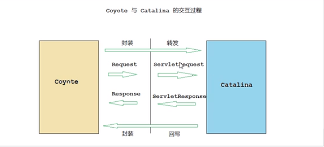

# Spring Web启动

## Tomcat体系架构


### 两个核心功能

1. 处理socket连接，负责网络字节流与Request和Response对象的转换（连接器）
2. 加载和管理Servlet，以及具体处理Request请求（容器）

### 连接器（Coyote）

Coyote是Tomcat的连接器框架的名称，也是Tomcat服务器提供的供客户端访问的外部接口。客户端通过Coyote与服务器建立连接、发送请求并接受响应。




### 架构讲解

####  Server

- 代表整个服务器（Server表示整个的Catalina Servlet容器）
- Tomcat提供了Server接口的一个默认实现，这通常不需要用户自己去实现
- 在Server容器中，可以包含**一个或多个Service组件**  

####  **Service** 

- Service是存活在Server内部的中间组件，它将**一个或多个连接器（Connector）组件绑定到一个单独的引擎（Engine）上**
- 在Server中，可以包含一个或多个Service组件。Service也很少由用户定制，Tomcat提供了Service接口的默认实现，而这种实现既简单又能满足应用
-  负责处理所有Connector所获得的客户请求 

#### Connector（连接器）

- 连接器（Connector）处理与客户端的通信，它负责接收客户请求，以及向客户返回响应结果（ 一个Connector将在某个指定端口上侦听客户请求，并将获得的请求交给Engine来处理，从Engine处获得回应并返回客户 ）

> 在Tomcat中，有多个连接器可以使用(HTTP、HTTPS、AJP...)

####  Engine（引擎）

- **Engine下可以配置多个虚拟主机Virtual  Host**，每个虚拟主机都有一个域名,当Engine获得一个请求时，它把该请求匹配到某个Host上，然后把该请求交给该Host来处理。
- Engine有一个默认虚拟主机，当请求无法匹配到任何一个Host上的时候，将交给该默认Host来处理

> 在Tomcat中，**每个Service只能包含一个Servlet引擎（Engine）**。引擎表示一个特定的Service的请求处理流水线。作为一个Service可以有多个连接器，引擎从连接器接收和处理所有的请求，将响应返回给适合的连接器，通过连接器传输给用户。用户允许通过实现Engine接口提供自定义的引擎，但通常不需要这么做。

####  Virtual Host （虚拟主机）

- 每个虚拟主机和某个网络域名Domain Name相匹配.
- 每个虚拟主机下都可以部署(deploy)一个或者多个Web  App，每个Web App对应于一个Context，有一个Context  path当Host获得一个请求时，将把该请求匹配到某个Context上，然后把该请求交给该Context来处理匹配的方法是“最长匹配”，所以一个path==”"的Context将成为该Host的默认Context所有无法和其它Context的路径名匹配的请求都将最终和该默认Context匹配

> Virtual Host表示一个虚拟主机，**一个引擎可以包含多个Host**。用户通常不需要创建自定义的Host，因为Tomcat给出的Host接口的实现（类StandardHost）提供了重要的附加功能。

####  **Context**（上下文）

- 一个Context对应于一个Web Application
- 一个Web  Application由一个或者多个Servlet组成
- Context在创建的时候将根据配置文件$CATALINA_HOME/conf/web.xml和$WEBAPP_HOME/WEB-INF/web.xml载入Servlet类
- 当Context获得请求时，将在自己的映射表(mapping table)中寻找相匹配的Servlet类如果找到，则执行该类，获得请求的回应，并返回

> 一个Context表示了一个Web应用程序，运行在特定的虚拟主机中。什么是Web应用程序呢？在Sun公司发布的Java Servlet规范中，对Web应用程序做出了如下的定义：“一个Web应用程序是由一组Servlet、HTML页面、类，以及其他的资源组成的运行在Web服务器上的完整的应用程序。它可以在多个供应商提供的实现了Servlet规范的Web容器中运行”。一个Host可以包含多个Context（代表Web应用程序），每一个Context都有一个唯一的路径。用户通常不需要创建自定义的Context，因为Tomcat给出的Context接口的实现（类StandardContext）提供了重要的附加功能。

### 解析

#### 脚本

##### startup.bat

- tomcat\lib\startup.bat

- ```cmake
  ...
  set "EXECUTABLE=%CATALINA_HOME%\bin\catalina.bat"
  ...
  call "%EXECUTABLE%" start %CMD_LINE_ARGS%
  ```

##### catalina.bat

- tomcat\lib\catalina.bat

- ```cmake
  if "%CLASSPATH%" == "" goto emptyClasspath
  set "CLASSPATH=%CLASSPATH%;"
  :emptyClasspath
  set "CLASSPATH=%CLASSPATH%%CATALINA_HOME%\bin\bootstrap.jar"
  
  if not "%CATALINA_TMPDIR%" == "" goto gotTmpdir
  set "CATALINA_TMPDIR=%CATALINA_BASE%\temp"
  :gotTmpdir
  
  rem Add tomcat-juli.jar to classpath
  rem tomcat-juli.jar can be over-ridden per instance
  if not exist "%CATALINA_BASE%\bin\tomcat-juli.jar" goto juliClasspathHome
  set "CLASSPATH=%CLASSPATH%;%CATALINA_BASE%\bin\tomcat-juli.jar"
  goto juliClasspathDone
  :juliClasspathHome
  set "CLASSPATH=%CLASSPATH%;%CATALINA_HOME%\bin\tomcat-juli.jar"
  :juliClasspathDone
  ```

##### bootstrap.jar

- tomcat\bin\bootstrap.jar

###### META-INF\MANIFEST.MF

- bootstrap.jar中的META-INF\MANIFEST.MF

  ```properties
  Manifest-Version: 1.0							##用来定义manifest文件的版本
  Ant-Version: Apache Ant 1.8.4
  Created-By: 1.6.0_45-b06 (Sun Microsystems Inc.)##声明该文件的生成者，一般该属性是由jar命令行工具生成的
  Main-Class: org.apache.catalina.startup.Bootstrap##定义jar文件的入口类，该类必须是一个可执行的类，一旦定义了该属性即可通过 java -jar x.jar来运行该jar文件
  Specification-Title: Apache Tomcat Bootstrap
  Specification-Version: 7.0
  Specification-Vendor: Apache Software Foundation
  Implementation-Title: Apache Tomcat Bootstrap	##定义了扩展实现的标题
  Implementation-Version: 7.0.69					##定义扩展实现的版本
  Implementation-Vendor: Apache Software Foundation##定义扩展实现的组织
  X-Compile-Source-JDK: 1.6
  X-Compile-Target-JDK: 1.6
  Class-Path: commons-daemon.jar					##应用程序或者类装载器使用该值来构建内部的类搜索路径
  ```

  1. META-INF文件夹相当于一个信息包，目录中的文件和目录获得Java 2平台的认可与解释
  2. 用来配置应用程序、扩展程序、类加载器和服务
  3. 这个文件夹和其中的 MANIFEST.MF文件，在用jar打包时自动生成

#### 代码

通过tomcat\bin\bootstrap.jar  中`MANIFEST.MF` 文件的 **Main-Class：org.apache.catalina.startup.Bootstrap**可以定义到Bootstrap中的main方法。

在Tomcat阅读时，注意有两个Bootstrap

- 由脚本启动的bootstrap.jar中的`MANIFEST.MF`指定的Main-Class：org.apache.catalina.startup.Bootstrap；

- 代码和上边的Bootstrap一样的 在 Tomcat\lib\catalina.jar org.apache.catalina.startup.Bootstrap；

  > 猜测可能是防止环境变量没有找到的情况//TO DO

正常流程：通过Bootstrap 加载了 org.apache.catalina.startup.Catalina(在tomcat\lib\catalina.jar中)