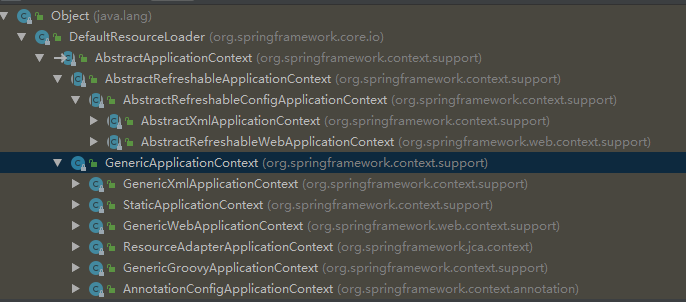

# Spring framework

## AliasRegistry

```java
package org.springframework.core;

/**
* 主要是对别名进行管理的顶级接口，可以实现简单的别名增删功能
*/
public interface AliasRegistry {

     /**
     * 注册表中给name注册一个别名alias
     */
	void registerAlias(String name, String alias);

     /**
     * 移除注册表中的别名alias
     */
	void removeAlias(String alias);

     /**
     * 校验注册表中是否存在别名name
     */
	boolean isAlias(String name);

    /**
     * 在注册表中获取给定那么的所有别名信息
     */
	String[] getAliases(String name);

}
```

## BeanDefinition

-  **Spring容器启动的过程中，会将Bean解析成Spring内部的BeanDefinition结构** 
-  **将Bean的定义信息存储到这个BeanDefinition相应的属性中，后面对Bean的操作就直接对BeanDefinition进行** 
- **继承AttributeAccessor，所以有对元数据访问的方法**
- **isLazyInit是否应该**延迟初始化此bean注意是否应该；单例才能有可能延时加载；延时加载设置@Lazy
- **isAutowireCandidate**返回此bean是否可以自动注入到其他bean；是否可以注入到其他bean中；与@Autowired相关
- **setAutowireCandidate**设置此bean是否可以自动注入到其他bean；

```java
package org.springframework.beans.factory.config;

import org.springframework.beans.BeanMetadataElement;
import org.springframework.beans.MutablePropertyValues;
import org.springframework.core.AttributeAccessor;

/**
 * 
 */
public interface BeanDefinition extends AttributeAccessor, BeanMetadataElement {

	/**
	 * 标准单例作用域的作用域标识符：“单例”
	 */
	String SCOPE_SINGLETON = ConfigurableBeanFactory.SCOPE_SINGLETON;

	/**
	 * 标准原型作用域的作用域标识符：“prototype”
	 */
	String SCOPE_PROTOTYPE = ConfigurableBeanFactory.SCOPE_PROTOTYPE;


	/**
	 * 
	 */
	int ROLE_APPLICATION = 0;

	/**
	 * 
	 */
	int ROLE_SUPPORT = 1;

	/**
	 * 
	 */
	int ROLE_INFRASTRUCTURE = 2;


	/**
	 *返回此bean定义的父定义的名称（如果有）
	 */
	String getParentName();

	/**
	 * 设置此bean定义的父定义的名称（如果有）。 
	 */
	void setParentName(String parentName);

	/**
	 * 返回此bean定义的当前bean类名
	 * 注意，这不一定是运行时使用的实际类名，在
     * 子定义重写/继承其父类名称的情况。
     * 因此，不要认为这是运行时的最终bean类型，但是
     * 而是只用于在单独的bean定义级别上进行解析   |||||是不是  &有关
	 */
	String getBeanClassName();

	/**
	 * 重写此bean定义的bean类名。 
     * 可以在bean工厂后处理期间修改类名
     * 通常将原始类名替换为已解析的它的变体
	 */
	void setBeanClassName(String beanClassName);

	/**
	 * 返回工厂bean名称（如果有） 
	 */
	String getFactoryBeanName();

	/**
	 * 指定要使用的工厂bean（如果有） 
	 */
	void setFactoryBeanName(String factoryBeanName);

	/**
	 * 返回工厂方法（如果有） 
	 */
	String getFactoryMethodName();

	/**
	 *指定工厂方法（如果有）。此方法将使用
     *构造函数参数，或者如果未指定任何参数，则不带任何参数。
     *方法将在指定的工厂bean上调用，如果有的话，
     *或者作为本地bean类上的静态方法。
     *@param factory method name静态工厂方法名，
     *或者{@code null}如果应该使用普通的构造函数创建
     *@请参阅getBeanClassName（）
	 */
	void setFactoryMethodName(String factoryMethodName);

	/**
	 * 返回此bean的当前目标作用域的名称
	 */
	String getScope();

	/**
	 * 重写此bean的目标作用域，指定新的作用域名称
	 */
	void setScope(String scope);

	/**
	 * 返回是否应延迟初始化此bean
	 * 启动时急切地实例化。仅适用于单例bean。
	 */
	boolean isLazyInit();

	/**
	 * 设置是否应延迟初始化此bean
	 * 如果{@code false}，bean将在启动时被bean实例化
	 * 执行单例初始化的工厂
	 */
	void setLazyInit(boolean lazyInit);

	/**
	 * 返回此bean所依赖的bean名称。
	 */
	String[] getDependsOn();

	/**
	 * 设置此bean依赖于初始化的bean的名称。
	 * bean工厂将保证首先初始化这些bean。 
	 */
	void setDependsOn(String... dependsOn);

	/**
	 * 返回此bean是否可以自动注入到其他bean
	 */
	boolean isAutowireCandidate();

	/**
	 * 设置此bean是否可以自动注入到其他bean。
	 */
	void setAutowireCandidate(boolean autowireCandidate);

	/**
	 * 多实例bean时
	 * 返回此bean是否为主要自动注入的首选对象
	 * 如果对于多个;匹配的候选人，它将作为一个平局打破
	 */
	boolean isPrimary();

	/**
	 *多实例bean时 
	 *设置此bean是否为主要自动注入候选对象
	 */
	void setPrimary(boolean primary);


	/**
	 * 返回此bean的构造函数参数值
	 * 返回的实例可以在bean工厂后处理期间修改
	 */
	ConstructorArgumentValues getConstructorArgumentValues();

	/**
	 * 返回要应用于bean的新实例的属性值
	 */
	MutablePropertyValues getPropertyValues();


	/**
	 * 是否单实例（单例：多个对象共享一个实例对象，可称：共享单例）
	 */
	boolean isSingleton();

	/**
	 *是否是原型实例
	 */
	boolean isPrototype();

	/**
	 * 返回这个bean是否是“抽象的”，也就是说，不是要实例化的
	 */
	boolean isAbstract();

	/**
	 * 获取此{@code BeanDefinition}的角色提示。角色提示
     *为框架和工具提供
     *特定{@code BeanDefinition}的角色和重要性
	 */
	int getRole();

	/**
	 * 返回此bean定义的可读描述
	 */
	String getDescription();

	/**
	 *返回此bean定义的资源的描述
	 */
	String getResourceDescription();

	/**
	 *返回原始BeanDefinition，如果没有则返回{@code null}。
     *允许检索修饰的bean定义（如果有）。
     *<p>请注意，此方法返回直接发起方。遍历
     *originator chain查找用户定义的原始BeanDefinitio
	 */
	BeanDefinition getOriginatingBeanDefinition();

}
```

## AttributeAccessor

-  定义用于附加和访问元数据的通用的接口

- 子类实现

  

```java
package org.springframework.core;

/**
 * 定义用于附加和访问元数据的通用的接口
 */
public interface AttributeAccessor {

	/**
	 * 设置属性的值
	 */
	void setAttribute(String name, Object value);

	/**
	 * 获得指定属性名称的值,如果不存在返回null
	 */
	Object getAttribute(String name);

	/**
	 * 删除指定的name的属性,如果不存在则返回null
	 */
	Object removeAttribute(String name);

	/**
	 * 判断指定的属性名称是否存在,注意属性名称必须是唯一的
	 */
	boolean hasAttribute(String name);

	/**
	 * 得到所有属性的名称
	 */
	String[] attributeNames();

}
```

### AttributeAccessorSupport

- 内部由 LinkedHashMap 实现源数据属性存储


```java
package org.springframework.core;

import java.io.Serializable;
import java.util.LinkedHashMap;
import java.util.Map;

import org.springframework.util.Assert;

/**
 * Support class for {@link AttributeAccessor AttributeAccessors}, providing
 * a base implementation of all methods. To be extended by subclasses.
 *
 * <p>{@link Serializable} if subclasses and all attribute values are {@link Serializable}.
 *
 * @author Rob Harrop
 * @author Juergen Hoeller
 * @since 2.0
 */
@SuppressWarnings("serial")
public abstract class AttributeAccessorSupport implements AttributeAccessor, Serializable {

	/** Map with String keys and Object values */
	private final Map<String, Object> attributes = new LinkedHashMap<String, Object>(0);


	@Override
	public void setAttribute(String name, Object value) {
		Assert.notNull(name, "Name must not be null");
		if (value != null) {
			this.attributes.put(name, value);
		}
		else {
			removeAttribute(name);
		}
	}

	@Override
	public Object getAttribute(String name) {
		Assert.notNull(name, "Name must not be null");
		return this.attributes.get(name);
	}

	@Override
	public Object removeAttribute(String name) {
		Assert.notNull(name, "Name must not be null");
		return this.attributes.remove(name);
	}

	@Override
	public boolean hasAttribute(String name) {
		Assert.notNull(name, "Name must not be null");
		return this.attributes.containsKey(name);
	}

	@Override
	public String[] attributeNames() {
		return this.attributes.keySet().toArray(new String[this.attributes.size()]);
	}

	protected void copyAttributesFrom(AttributeAccessor source) {
		Assert.notNull(source, "Source must not be null");
		String[] attributeNames = source.attributeNames();
		for (String attributeName : attributeNames) {
			setAttribute(attributeName, source.getAttribute(attributeName));
		}
	}


	@Override
	public boolean equals(Object other) {
		if (this == other) {
			return true;
		}
		if (!(other instanceof AttributeAccessorSupport)) {
			return false;
		}
		AttributeAccessorSupport that = (AttributeAccessorSupport) other;
		return this.attributes.equals(that.attributes);
	}

	@Override
	public int hashCode() {
		return this.attributes.hashCode();
	}

}
```


## BeanDefinitionRegistry

- 继承AliasRegistry

```java
package org.springframework.beans.factory.support;

import org.springframework.beans.factory.BeanDefinitionStoreException;
import org.springframework.beans.factory.NoSuchBeanDefinitionException;
import org.springframework.beans.factory.config.BeanDefinition;
import org.springframework.core.AliasRegistry;


public interface BeanDefinitionRegistry extends AliasRegistry {

	void registerBeanDefinition(String beanName, BeanDefinition beanDefinition)
			throws BeanDefinitionStoreException;

	void removeBeanDefinition(String beanName) throws NoSuchBeanDefinitionException;

	BeanDefinition getBeanDefinition(String beanName) throws NoSuchBeanDefinitionException;

	boolean containsBeanDefinition(String beanName);

	String[] getBeanDefinitionNames();

	int getBeanDefinitionCount();

	boolean isBeanNameInUse(String beanName);

}

```


## DefaultListableBeanFactory


# Spring framework 源码分析


## AnnotationConfigApplicationContext

- 独立的应用程序上下文

- 和JSR-330兼容（ `Spring开始支持JSR-330标准的注解（依赖注入）` ）

  | Spring                | javax.inject.*      | javax.inject 限制                                            |
  | --------------------- | ------------------- | ------------------------------------------------------------ |
  | `@Autowired`          | `@Inject`           | @Inject注解没有required属性，但是可以通过Java 8的Optional取代 |
  | `@Component`          | `@Named`            | JSR_330标准并没有提供复合的模型，只有一种方式来识别组件      |
  | `@Scope(“singleton”)` | `@Singleton`        | JSR-330默认的作用域类似Spring的prototype，然而，为何和Spring的默认保持一致，JSR-330标准中的Bean在Spring中默认也是单例的。如果要使用非单例的作用域，开发者应该使用Spring的@Scope注解。java.inject也提供一个@Scope注解，然而，这个注解仅仅可以用来创建自定义的作用域时才能使用。 |
  | `@Qualifier`          | `@Qualifier/@Named` | javax.inject.Qualifier仅仅是一个元注解，用来构建自定义限定符的。而String的限定符（比如Spring中的@Qualifier）可以通过javax.inject.Named来实现 |
  | `@Value`              | \-                  | 不等价                                                       |
  | `@Required`           | \-                  | 不等价                                                       |
  | `@Lazy`               | \-                  | 不等价                                                       |
  | `ObjectFactory`       | `Provider`          | javax.inject.Provider是SpringObjectFactory的另一个选择，通过get()方法来代理，Provider可以和Spring的@Autowired组合使用 |

  //todo JSR-250

## AbstractApplicationContext通用上下文

- 

- 