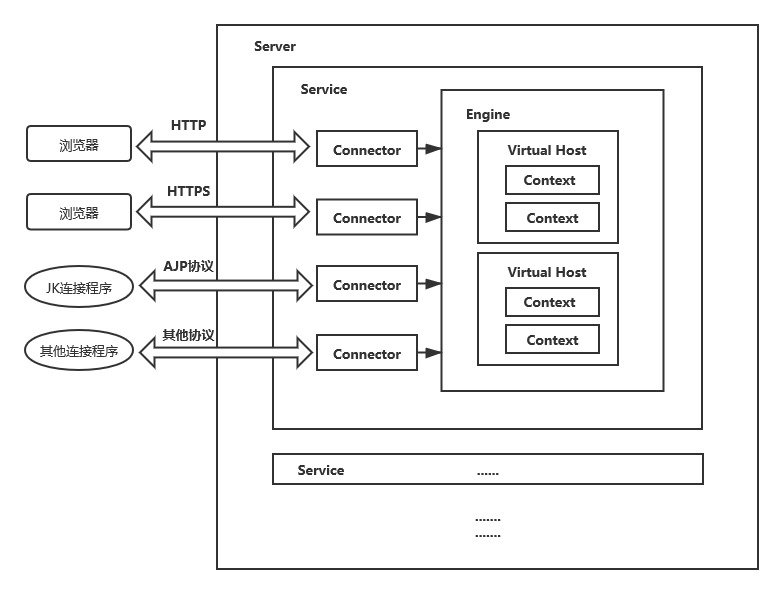
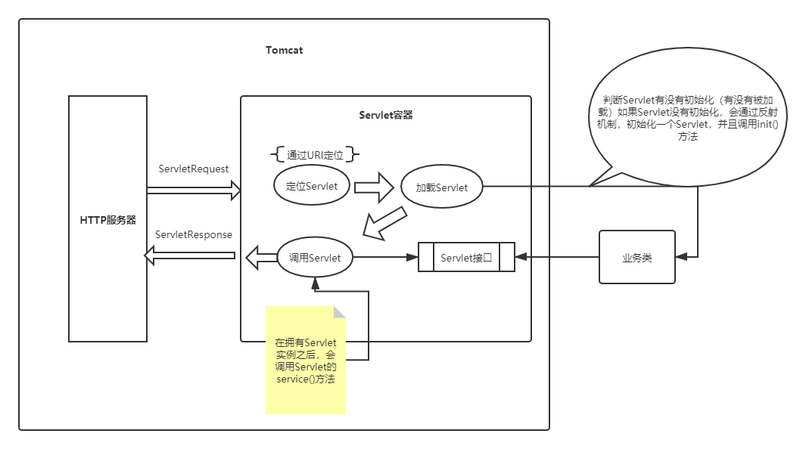
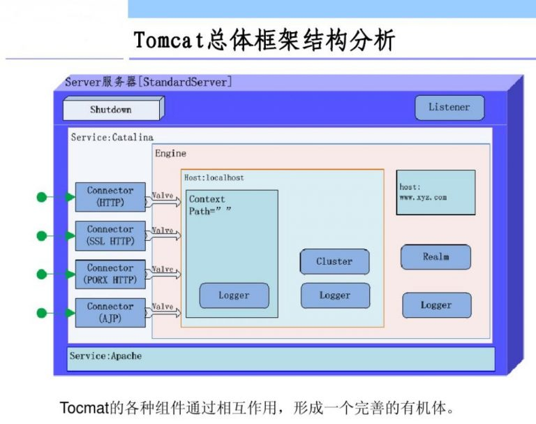
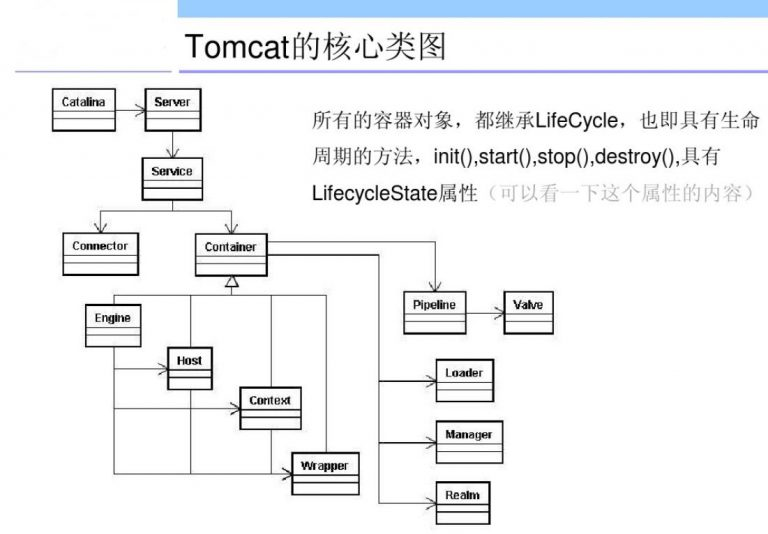
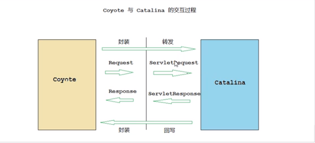

## Tomcat体系架构










### 架构讲解

####  Server

- 代表整个服务器（Server表示整个的Catalina Servlet容器）
- Tomcat提供了Server接口的一个默认实现，这通常不需要用户自己去实现
- 在Server容器中，可以包含**一个或多个Service组件**  

####  **Service** 

- Service是存活在Server内部的中间组件，它将**一个或多个连接器（Connector）组件绑定到一个单独的引擎（Engine）上**
- 在Server中，可以包含一个或多个Service组件。Service也很少由用户定制，Tomcat提供了Service接口的默认实现，而这种实现既简单又能满足应用
- 负责处理所有Connector所获得的客户请求 

#### Connector（连接器）

- 连接器（Connector）处理与客户端的通信，它负责接收客户请求，以及向客户返回响应结果（ 一个Connector将在某个指定端口上侦听客户请求，并将获得的请求交给Engine来处理，从Engine处获得回应并返回客户 ）

> 在Tomcat中，有多个连接器可以使用(HTTP、HTTPS、AJP...)

####  Engine（引擎）

- **Engine下可以配置多个虚拟主机Virtual  Host**，每个虚拟主机都有一个域名,当Engine获得一个请求时，它把该请求匹配到某个Host上，然后把该请求交给该Host来处理。
- Engine有一个默认虚拟主机，当请求无法匹配到任何一个Host上的时候，将交给该默认Host来处理

> 在Tomcat中，**每个Service只能包含一个Servlet引擎（Engine）**。引擎表示一个特定的Service的请求处理流水线。作为一个Service可以有多个连接器，引擎从连接器接收和处理所有的请求，将响应返回给适合的连接器，通过连接器传输给用户。用户允许通过实现Engine接口提供自定义的引擎，但通常不需要这么做。

####  Virtual Host （虚拟主机）

- 每个虚拟主机和某个网络域名Domain Name相匹配.
- 每个虚拟主机下都可以部署(deploy)一个或者多个Web  App，每个Web App对应于一个Context，有一个Context  path当Host获得一个请求时，将把该请求匹配到某个Context上，然后把该请求交给该Context来处理匹配的方法是“最长匹配”，所以一个path==”"的Context将成为该Host的默认Context所有无法和其它Context的路径名匹配的请求都将最终和该默认Context匹配

> Virtual Host表示一个虚拟主机，**一个引擎可以包含多个Host**。用户通常不需要创建自定义的Host，因为Tomcat给出的Host接口的实现（类StandardHost）提供了重要的附加功能。

####  **Context**（上下文）

- 一个Context对应于一个Web Application
- 一个Web  Application由一个或者多个Servlet组成
- Context在创建的时候将根据配置文件$CATALINA_HOME/conf/web.xml和$WEBAPP_HOME/WEB-INF/web.xml载入Servlet类
- 当Context获得请求时，将在自己的映射表(mapping table)中寻找相匹配的Servlet类如果找到，则执行该类，获得请求的回应，并返回

> 一个Context表示了一个Web应用程序，运行在特定的虚拟主机中。什么是Web应用程序呢？在Sun公司发布的Java Servlet规范中，对Web应用程序做出了如下的定义：“一个Web应用程序是由一组Servlet、HTML页面、类，以及其他的资源组成的运行在Web服务器上的完整的应用程序。它可以在多个供应商提供的实现了Servlet规范的Web容器中运行”。一个Host可以包含多个Context（代表Web应用程序），每一个Context都有一个唯一的路径。用户通常不需要创建自定义的Context，因为Tomcat给出的Context接口的实现（类StandardContext）提供了重要的附加功能。

### 两个核心功能

1. 处理socket连接，负责网络字节流与Request和Response对象的转换（连接器）
2. 加载和管理Servlet，以及具体处理Request请求（容器）

### 连接器（Coyote）

Coyote是Tomcat的连接器框架的名称，也是Tomcat服务器提供的供客户端访问的外部接口。客户端通过Coyote与服务器建立连接、发送请求并接受响应。



#### 连接器组件


##### Endpoint

- 监听通信端口，接收Socket请求，用来实现TCP/IP协议的，对具体的Socket接收和发送处理器。


### Tomcat服务器配置

#### server.xml

> 在server.xml中，可以更清晰的认知Tomcat的框架。

是Tomcat服务器配置的核心配置文件，包含了Tomcat的Servlet容器（Catalina）的所有配置。

##### Server

是server.xml的根元素，用于创建一个Server实例，默认使用的实现类是`org.apache.catalina.core.StandardServer`。

```xml
<Server port="8005" shutdown="SHUTDOWN">
    ...
</Server>
```

- port:Tomcat监听关闭服务的端口
- shutdown：关闭服务器使用的指令字符串

Server内嵌子元素为`Listener`、`GlobalNamingResources`、`Service`

- `Listener`

  ```xml
  <Listener className="org.apache.catalina.startup.VersionLoggerListener" />
    <!-- Security listener. Documentation at /docs/config/listeners.html
    <Listener className="org.apache.catalina.security.SecurityListener" />
    -->
    <!--APR library loader. Documentation at /docs/apr.html -->
    <!--用于加载（服务器启动）和销毁（服务器停止）APR，如果找不到APR，则会输出日志，并不会影响Tomcat的启动-->
    <Listener className="org.apache.catalina.core.AprLifecycleListener" SSLEngine="on" />
    <!--Initialize Jasper prior to webapps are loaded. Documentation at /docs/jasper-howto.html -->
    <!--初始化JSP解析器-->
    <Listener className="org.apache.catalina.core.JasperListener" />
    <!-- Prevent memory leaks due to use of particular java/javax APIs-->
    <!--用于避免JRE内存泄漏问题-->
    <Listener className="org.apache.catalina.core.JreMemoryLeakPreventionListener" />
    <!--用于加载（服务器启动）和销毁（服务器停止）全局命名服务-->
    <Listener className="org.apache.catalina.mbeans.GlobalResourcesLifecycleListener" />
    <!--用于在Context停止时，重建Executor池中的线程，以避免ThreadLocal相关的内存泄漏-->
    <Listener className="org.apache.catalina.core.ThreadLocalLeakPreventionListener" />
  ```

- `GlobalNamingResources`中定义了全局命名服务

  ```xml
    <GlobalNamingResources>
      <!-- Editable user database that can also be used by
           UserDatabaseRealm to authenticate users
      -->
      <Resource name="UserDatabase" auth="Container"
                type="org.apache.catalina.UserDatabase"
                description="User database that can be updated and saved"
                factory="org.apache.catalina.users.MemoryUserDatabaseFactory"
                pathname="conf/tomcat-users.xml" /><!--用户角色配置信息-->
    </GlobalNamingResources>
  ```


##### Service

该元素用于创建Service实例，默认使用`org.apache.catalina.core.StandardService`实现，默认情况下仅指定了Service的名称，值为`Catalina`。

service的内嵌元素为：

- Listener

  为Service添加生命周期监听器

- Executor

  用于配置Service共享线程池

- Connector

  配置Service包含的连接器

- Engine

  用于配置Service中连接器对应的Servlet容器引擎

```xml
<Service name="Catalina">
    ...
</Service>
```

一个Server容器可以包含多个Service服务。


##### Executor

##### Connector

##### Engine

##### Host

##### Context


### 解析

#### 脚本

##### startup.bat

- tomcat\lib\startup.bat

- ```cmake
  ...
  set "EXECUTABLE=%CATALINA_HOME%\bin\catalina.bat"
  ...
  call "%EXECUTABLE%" start %CMD_LINE_ARGS%
  ```

##### catalina.bat

- tomcat\lib\catalina.bat

- ```cmake
  if "%CLASSPATH%" == "" goto emptyClasspath
  set "CLASSPATH=%CLASSPATH%;"
  :emptyClasspath
  set "CLASSPATH=%CLASSPATH%%CATALINA_HOME%\bin\bootstrap.jar"
  
  if not "%CATALINA_TMPDIR%" == "" goto gotTmpdir
  set "CATALINA_TMPDIR=%CATALINA_BASE%\temp"
  :gotTmpdir
  
  rem Add tomcat-juli.jar to classpath
  rem tomcat-juli.jar can be over-ridden per instance
  if not exist "%CATALINA_BASE%\bin\tomcat-juli.jar" goto juliClasspathHome
  set "CLASSPATH=%CLASSPATH%;%CATALINA_BASE%\bin\tomcat-juli.jar"
  goto juliClasspathDone
  :juliClasspathHome
  set "CLASSPATH=%CLASSPATH%;%CATALINA_HOME%\bin\tomcat-juli.jar"
  :juliClasspathDone
  ```

##### bootstrap.jar

- tomcat\bin\bootstrap.jar

###### META-INF\MANIFEST.MF

- bootstrap.jar中的META-INF\MANIFEST.MF

  ```properties
  Manifest-Version: 1.0							##用来定义manifest文件的版本
  Ant-Version: Apache Ant 1.8.4
  Created-By: 1.6.0_45-b06 (Sun Microsystems Inc.)##声明该文件的生成者，一般该属性是由jar命令行工具生成的
  Main-Class: org.apache.catalina.startup.Bootstrap##定义jar文件的入口类，该类必须是一个可执行的类，一旦定义了该属性即可通过 java -jar x.jar来运行该jar文件
  Specification-Title: Apache Tomcat Bootstrap
  Specification-Version: 7.0
  Specification-Vendor: Apache Software Foundation
  Implementation-Title: Apache Tomcat Bootstrap	##定义了扩展实现的标题
  Implementation-Version: 7.0.69					##定义扩展实现的版本
  Implementation-Vendor: Apache Software Foundation##定义扩展实现的组织
  X-Compile-Source-JDK: 1.6
  X-Compile-Target-JDK: 1.6
  Class-Path: commons-daemon.jar					##应用程序或者类装载器使用该值来构建内部的类搜索路径
  ```

  1. META-INF文件夹相当于一个信息包，目录中的文件和目录获得Java 2平台的认可与解释
  2. 用来配置应用程序、扩展程序、类加载器和服务
  3. 这个文件夹和其中的 MANIFEST.MF文件，在用jar打包时自动生成

#### 代码

(约定：...code... 省略代码)

通过tomcat\bin\bootstrap.jar  中`MANIFEST.MF` 文件的 **Main-Class：org.apache.catalina.startup.Bootstrap**可以定义到Bootstrap中的main方法。

在Tomcat阅读时，注意有两个Bootstrap

- 由脚本启动的bootstrap.jar中的`MANIFEST.MF`指定的Main-Class：org.apache.catalina.startup.Bootstrap；

- 代码和上边的Bootstrap一样的 在 Tomcat\lib\catalina.jar org.apache.catalina.startup.Bootstrap；

  > 猜测可能是防止环境变量没有找到的情况//TO DO

正常流程：通过Bootstrap 加载了 org.apache.catalina.startup.Catalina(在tomcat\lib\catalina.jar中)


##### Bootstrap

```java
	/**简化后main**/
    public static void main(String[] args) {
        /*...code...*/
        if (daemon == null) {
            /*
            * 1.创建Bootstrap
            */
            Bootstrap bootstrap = new Bootstrap();
            /**
            * 2.初始化Bootstrap (添加环境变量,通过get校验为null的话,重新set)
            *	(1).setCatalinaHome：  
            *		System.setProperty("catalina.home", (new File(System.getProperty("user.dir"), "..")).getCanonicalPath());
            *	(2).setCatalinaBase:
            *		System.setProperty("catalina.base", System.getProperty("catalina.home"));
            *	(3).initClassLoaders(初始化类加载器):
            *		 this.commonLoader = this.createClassLoader("common", (ClassLoader)null);
            *		 this.catalinaLoader = this.createClassLoader("server", this.commonLoader);
            *		 this.sharedLoader = this.createClassLoader("shared", this.commonLoader);
            */	
            bootstrap.init();
            daemon = bootstrap;
        } else {
            Thread.currentThread().setContextClassLoader(daemon.catalinaLoader);
        }

        try {
            String command = "start";
            if (args.length > 0) {
                command = args[args.length - 1];
            }

            if (command.equals("startd")) {
                args[args.length - 1] = "start";
                daemon.load(args);
                daemon.start();
            } else if (command.equals("stopd")) {
                args[args.length - 1] = "stop";
                daemon.stop();
            } else if (command.equals("start")) {
                daemon.setAwait(true);
                daemon.load(args);
                daemon.start();
            } else if (command.equals("stop")) {
                daemon.stopServer(args);
            } else if (command.equals("configtest")) {
                daemon.load(args);
                if (null == daemon.getServer()) {
                    System.exit(1);
                }

                System.exit(0);
            } else {
                log.warn("Bootstrap: command \"" + command + "\" does not exist.");
            }
        } catch (Throwable var4) {
            Throwable t = var4;
            if (var4 instanceof InvocationTargetException && var4.getCause() != null) {
                t = var4.getCause();
            }

            handleThrowable(t);
            t.printStackTrace();
            System.exit(1);
        }

    }
```

### 源码环境搭建

1. 下载源码

2. 创建home文件

3. conf 和 webapps复制到home文件

4. maven工程

   pom.xml

   ```xml
   <?xml version="1.0" encoding="UTF-8"?>
   <project xmlns="http://maven.apache.org/POM/4.0.0"
       xmlns:xsi="http://www.w3.org/2001/XMLSchema-instance"
       xsi:schemaLocation="http://maven.apache.org/POM/4.0.0 http://maven.apache.org/xsd/maven-4.0.0.xsd">
   
     <modelVersion>4.0.0</modelVersion>
     <groupId>com.example.tomcat</groupId>
     <artifactId>Tomcat</artifactId>
     <name>Tomcat</name>
     <version>1.0</version>
   
     <build>
       <plugins>
         <plugin>
           <groupId>org.apache.maven.plugins</groupId>
           <artifactId>maven-compiler-plugin</artifactId>
           <version>2.3</version>
           <configuration>
             <encoding>UTF-8</encoding>
             <source>1.8</source>
             <target>1.8</target>
           </configuration>
         </plugin>
       </plugins>
     </build>
   
     <dependencies>
       <dependency>
         <groupId>junit</groupId>
         <artifactId>junit</artifactId>
         <version>4.12</version>
         <scope>test</scope>
       </dependency>
       <dependency>
         <groupId>org.easymock</groupId>
         <artifactId>easymock</artifactId>
         <version>3.4</version>
       </dependency>
       <dependency>
         <groupId>ant</groupId>
         <artifactId>ant</artifactId>
         <version>1.7.0</version>
       </dependency>
       <dependency>
         <groupId>wsdl4j</groupId>
         <artifactId>wsdl4j</artifactId>
         <version>1.6.2</version>
       </dependency>
       <dependency>
         <groupId>javax.xml</groupId>
         <artifactId>jaxrpc</artifactId>
         <version>1.1</version>
       </dependency>
       <dependency>
         <groupId>org.eclipse.jdt.core.compiler</groupId>
         <artifactId>ecj</artifactId>
         <version>4.5.1</version>
       </dependency>
     </dependencies>
   </project>
   ```

5. 导入该pom.xml

6. 在java目录下org.apache.catalina.startup中的Bootstrap有main方法

7. 配置启动类Application  Main class:org.apache.catalina.startup.Bootstrap

8. VM options:

   ```tex
   -Dcatalina.home=${}/home
   -Dcatalina.base=${}/home
   -Djava.util.logging.manager=org.apache.juli.ClassLoaderLogManager
   -Djava.util.logging.config.file=${}/home/conf/logging.properties
   ```

9. 可以启动Bootstrap


### 源码阅读

####  Lifecycle（生命周期）


```java
/*
 * Licensed to the Apache Software Foundation (ASF) under one or more
 * contributor license agreements.  See the NOTICE file distributed with
 * this work for additional information regarding copyright ownership.
 * The ASF licenses this file to You under the Apache License, Version 2.0
 * (the "License"); you may not use this file except in compliance with
 * the License.  You may obtain a copy of the License at
 *
 *      http://www.apache.org/licenses/LICENSE-2.0
 *
 * Unless required by applicable law or agreed to in writing, software
 * distributed under the License is distributed on an "AS IS" BASIS,
 * WITHOUT WARRANTIES OR CONDITIONS OF ANY KIND, either express or implied.
 * See the License for the specific language governing permissions and
 * limitations under the License.
 */
package org.apache.catalina;


/**
 * Common interface for component life cycle methods.  Catalina components
 * may implement this interface (as well as the appropriate interface(s) for
 * the functionality they support) in order to provide a consistent mechanism
 * to start and stop the component.
 * <br>
 * The valid state transitions for components that support {@link Lifecycle}
 * are:
 * <pre>
 *            start()
 *  -----------------------------
 *  |                           |
 *  | init()                    |
 * NEW -»-- INITIALIZING        |
 * | |           |              |     ------------------«-----------------------
 * | |           |auto          |     |                                        |
 * | |          \|/    start() \|/   \|/     auto          auto         stop() |
 * | |      INITIALIZED --»-- STARTING_PREP --»- STARTING --»- STARTED --»---  |
 * | |         |                                                            |  |
 * | |destroy()|                                                            |  |
 * | --»-----«--    ------------------------«--------------------------------  ^
 * |     |          |                                                          |
 * |     |         \|/          auto                 auto              start() |
 * |     |     STOPPING_PREP ----»---- STOPPING ------»----- STOPPED -----»-----
 * |    \|/                               ^                     |  ^
 * |     |               stop()           |                     |  |
 * |     |       --------------------------                     |  |
 * |     |       |                                              |  |
 * |     |       |    destroy()                       destroy() |  |
 * |     |    FAILED ----»------ DESTROYING ---«-----------------  |
 * |     |                        ^     |                          |
 * |     |     destroy()          |     |auto                      |
 * |     --------»-----------------    \|/                         |
 * |                                 DESTROYED                     |
 * |                                                               |
 * |                            stop()                             |
 * ----»-----------------------------»------------------------------
 *
 * Any state can transition to FAILED.
 *
 * Calling start() while a component is in states STARTING_PREP, STARTING or
 * STARTED has no effect.
 *
 * Calling start() while a component is in state NEW will cause init() to be
 * called immediately after the start() method is entered.
 *
 * Calling stop() while a component is in states STOPPING_PREP, STOPPING or
 * STOPPED has no effect.
 *
 * Calling stop() while a component is in state NEW transitions the component
 * to STOPPED. This is typically encountered when a component fails to start and
 * does not start all its sub-components. When the component is stopped, it will
 * try to stop all sub-components - even those it didn't start.
 *
 * Attempting any other transition will throw {@link LifecycleException}.
 *
 * </pre>
 * The {@link LifecycleEvent}s fired during state changes are defined in the
 * methods that trigger the changed. No {@link LifecycleEvent}s are fired if the
 * attempted transition is not valid.
 *
 * @author Craig R. McClanahan
 */
public interface Lifecycle {


    // ----------------------------------------------------- Manifest Constants


    /**
     * The LifecycleEvent type for the "component before init" event.
     */
    public static final String BEFORE_INIT_EVENT = "before_init";


    /**
     * The LifecycleEvent type for the "component after init" event.
     */
    public static final String AFTER_INIT_EVENT = "after_init";


    /**
     * The LifecycleEvent type for the "component start" event.
     */
    public static final String START_EVENT = "start";


    /**
     * The LifecycleEvent type for the "component before start" event.
     */
    public static final String BEFORE_START_EVENT = "before_start";


    /**
     * The LifecycleEvent type for the "component after start" event.
     */
    public static final String AFTER_START_EVENT = "after_start";


    /**
     * The LifecycleEvent type for the "component stop" event.
     */
    public static final String STOP_EVENT = "stop";


    /**
     * The LifecycleEvent type for the "component before stop" event.
     */
    public static final String BEFORE_STOP_EVENT = "before_stop";


    /**
     * The LifecycleEvent type for the "component after stop" event.
     */
    public static final String AFTER_STOP_EVENT = "after_stop";


    /**
     * The LifecycleEvent type for the "component after destroy" event.
     */
    public static final String AFTER_DESTROY_EVENT = "after_destroy";


    /**
     * The LifecycleEvent type for the "component before destroy" event.
     */
    public static final String BEFORE_DESTROY_EVENT = "before_destroy";


    /**
     * The LifecycleEvent type for the "periodic" event.
     */
    public static final String PERIODIC_EVENT = "periodic";


    /**
     * The LifecycleEvent type for the "configure_start" event. Used by those
     * components that use a separate component to perform configuration and
     * need to signal when configuration should be performed - usually after
     * {@link #BEFORE_START_EVENT} and before {@link #START_EVENT}.
     */
    public static final String CONFIGURE_START_EVENT = "configure_start";


    /**
     * The LifecycleEvent type for the "configure_stop" event. Used by those
     * components that use a separate component to perform configuration and
     * need to signal when de-configuration should be performed - usually after
     * {@link #STOP_EVENT} and before {@link #AFTER_STOP_EVENT}.
     */
    public static final String CONFIGURE_STOP_EVENT = "configure_stop";


    // --------------------------------------------------------- Public Methods


    /**
     * Add a LifecycleEvent listener to this component.
     *
     * @param listener The listener to add
     */
    public void addLifecycleListener(LifecycleListener listener);


    /**
     * Get the life cycle listeners associated with this life cycle.
     *
     * @return An array containing the life cycle listeners associated with this
     *         life cycle. If this component has no listeners registered, a
     *         zero-length array is returned.
     */
    public LifecycleListener[] findLifecycleListeners();


    /**
     * Remove a LifecycleEvent listener from this component.
     *
     * @param listener The listener to remove
     */
    public void removeLifecycleListener(LifecycleListener listener);


    /**
     * Prepare the component for starting. This method should perform any
     * initialization required post object creation. The following
     * {@link LifecycleEvent}s will be fired in the following order:
     * <ol>
     *   <li>INIT_EVENT: On the successful completion of component
     *                   initialization.</li>
     * </ol>
     *
     * @exception LifecycleException if this component detects a fatal error
     *  that prevents this component from being used
     */
    public void init() throws LifecycleException;

    /**
     * Prepare for the beginning of active use of the public methods other than
     * property getters/setters and life cycle methods of this component. This
     * method should be called before any of the public methods other than
     * property getters/setters and life cycle methods of this component are
     * utilized. The following {@link LifecycleEvent}s will be fired in the
     * following order:
     * <ol>
     *   <li>BEFORE_START_EVENT: At the beginning of the method. It is as this
     *                           point the state transitions to
     *                           {@link LifecycleState#STARTING_PREP}.</li>
     *   <li>START_EVENT: During the method once it is safe to call start() for
     *                    any child components. It is at this point that the
     *                    state transitions to {@link LifecycleState#STARTING}
     *                    and that the public methods other than property
     *                    getters/setters and life cycle methods may be
     *                    used.</li>
     *   <li>AFTER_START_EVENT: At the end of the method, immediately before it
     *                          returns. It is at this point that the state
     *                          transitions to {@link LifecycleState#STARTED}.
     *                          </li>
     * </ol>
     *
     * @exception LifecycleException if this component detects a fatal error
     *  that prevents this component from being used
     */
    public void start() throws LifecycleException;


    /**
     * Gracefully terminate the active use of the public methods other than
     * property getters/setters and life cycle methods of this component. Once
     * the STOP_EVENT is fired, the public methods other than property
     * getters/setters and life cycle methods should not be used. The following
     * {@link LifecycleEvent}s will be fired in the following order:
     * <ol>
     *   <li>BEFORE_STOP_EVENT: At the beginning of the method. It is at this
     *                          point that the state transitions to
     *                          {@link LifecycleState#STOPPING_PREP}.</li>
     *   <li>STOP_EVENT: During the method once it is safe to call stop() for
     *                   any child components. It is at this point that the
     *                   state transitions to {@link LifecycleState#STOPPING}
     *                   and that the public methods other than property
     *                   getters/setters and life cycle methods may no longer be
     *                   used.</li>
     *   <li>AFTER_STOP_EVENT: At the end of the method, immediately before it
     *                         returns. It is at this point that the state
     *                         transitions to {@link LifecycleState#STOPPED}.
     *                         </li>
     * </ol>
     *
     * Note that if transitioning from {@link LifecycleState#FAILED} then the
     * three events above will be fired but the component will transition
     * directly from {@link LifecycleState#FAILED} to
     * {@link LifecycleState#STOPPING}, bypassing
     * {@link LifecycleState#STOPPING_PREP}
     *
     * @exception LifecycleException if this component detects a fatal error
     *  that needs to be reported
     */
    public void stop() throws LifecycleException;

    /**
     * Prepare to discard the object. The following {@link LifecycleEvent}s will
     * be fired in the following order:
     * <ol>
     *   <li>DESTROY_EVENT: On the successful completion of component
     *                      destruction.</li>
     * </ol>
     *
     * @exception LifecycleException if this component detects a fatal error
     *  that prevents this component from being used
     */
    public void destroy() throws LifecycleException;


    /**
     * Obtain the current state of the source component.
     *
     * @return The current state of the source component.
     */
    public LifecycleState getState();


    /**
     * Obtain a textual representation of the current component state. Useful
     * for JMX. The format of this string may vary between point releases and
     * should not be relied upon to determine component state. To determine
     * component state, use {@link #getState()}.
     *
     * @return The name of the current component state.
     */
    public String getStateName();


    /**
     * Marker interface used to indicate that the instance should only be used
     * once. Calling {@link #stop()} on an instance that supports this interface
     * will automatically call {@link #destroy()} after {@link #stop()}
     * completes.
     */
    public interface SingleUse {
    }
}

```


- 全局常量类

  ```java
  package org.apache.catalina;
  
  import org.apache.tomcat.util.compat.JreVendor;
  
  public final class Globals {
  
      public static final String ALT_DD_ATTR =
          "org.apache.catalina.deploy.alt_dd";
  
      public static final String CERTIFICATES_ATTR =
          "javax.servlet.request.X509Certificate";
  
      public static final String CIPHER_SUITE_ATTR =
          "javax.servlet.request.cipher_suite";
  
      public static final String DISPATCHER_TYPE_ATTR =
          "org.apache.catalina.core.DISPATCHER_TYPE";
  
      public static final String DISPATCHER_REQUEST_PATH_ATTR =
          "org.apache.catalina.core.DISPATCHER_REQUEST_PATH";
  
      public static final String RESOURCES_ATTR =
          "org.apache.catalina.resources";
  
      public static final String CLASS_PATH_ATTR =
          "org.apache.catalina.jsp_classpath";
  
      public static final String KEY_SIZE_ATTR =
          "javax.servlet.request.key_size";
  
      public static final String SSL_SESSION_ID_ATTR =
          "javax.servlet.request.ssl_session_id";
  
      @Deprecated
      public static final String SSL_SESSION_ID_TOMCAT_ATTR =
          "javax.servlet.request.ssl_session";
  
      public static final String SSL_SESSION_MGR_ATTR =
          "javax.servlet.request.ssl_session_mgr";
  
      @Deprecated
      public static final String MBEAN_REGISTRY_ATTR =
          "org.apache.catalina.Registry";
  
      @Deprecated
      public static final String MBEAN_SERVER_ATTR =
          "org.apache.catalina.MBeanServer";
  
      public static final String NAMED_DISPATCHER_ATTR =
          "org.apache.catalina.NAMED";
  
      @Deprecated
      public static final String SSI_FLAG_ATTR = "org.apache.catalina.ssi.SSIServlet";
  
      public static final String SUBJECT_ATTR =
          "javax.security.auth.subject";
  
      public static final String GSS_CREDENTIAL_ATTR =
          "org.apache.catalina.realm.GSS_CREDENTIAL";
  
      @Deprecated
      public static final String TOMCAT_CONNECTOR_ATTR_PREFIX =
          "org.apache.tomcat.";
  
      public static final String COMET_SUPPORTED_ATTR =
          org.apache.coyote.Constants.COMET_SUPPORTED_ATTR;
  
      public static final String COMET_TIMEOUT_SUPPORTED_ATTR =
              org.apache.coyote.Constants.COMET_TIMEOUT_SUPPORTED_ATTR;
  
      public static final String COMET_TIMEOUT_ATTR =
          org.apache.coyote.Constants.COMET_TIMEOUT_ATTR;
  
      public static final String SENDFILE_SUPPORTED_ATTR =
              org.apache.coyote.Constants.SENDFILE_SUPPORTED_ATTR;
  
      public static final String SENDFILE_FILENAME_ATTR =
              org.apache.coyote.Constants.SENDFILE_FILENAME_ATTR;
  
      public static final String SENDFILE_FILE_START_ATTR =
              org.apache.coyote.Constants.SENDFILE_FILE_START_ATTR;
  
      public static final String SENDFILE_FILE_END_ATTR =
              org.apache.coyote.Constants.SENDFILE_FILE_END_ATTR;
  
      public static final String REMOTE_ADDR_ATTRIBUTE =
              org.apache.coyote.Constants.REMOTE_ADDR_ATTRIBUTE;
  
      public static final String REQUEST_FORWARDED_ATTRIBUTE =
          "org.apache.tomcat.request.forwarded";
  
      public static final String ASYNC_SUPPORTED_ATTR =
          "org.apache.catalina.ASYNC_SUPPORTED";
  
      public static final String PARAMETER_PARSE_FAILED_ATTR =
          "org.apache.catalina.parameter_parse_failed";
  
      public static final String PARAMETER_PARSE_FAILED_REASON_ATTR =
              "org.apache.catalina.parameter_parse_failed_reason";
  
      public static final boolean STRICT_SERVLET_COMPLIANCE =
          Boolean.parseBoolean(System.getProperty("org.apache.catalina.STRICT_SERVLET_COMPLIANCE", "false"));
  
      public static final boolean IS_SECURITY_ENABLED =
          (System.getSecurityManager() != null);
  
      public static final String DEFAULT_MBEAN_DOMAIN = "Catalina";
  
      public static final String CATALINA_HOME_PROP = "catalina.home";
  
      public static final String CATALINA_BASE_PROP = "catalina.base";
  
      public static final String JASPER_XML_VALIDATION_TLD_INIT_PARAM =
              "org.apache.jasper.XML_VALIDATE_TLD";
  
      public static final String JASPER_XML_VALIDATION_INIT_PARAM =
              "org.apache.jasper.XML_VALIDATE";
  
      public static final String JASPER_XML_BLOCK_EXTERNAL_INIT_PARAM =
              "org.apache.jasper.XML_BLOCK_EXTERNAL";
  
      public static final String WEBAPP_VERSION = "org.apache.catalina.webappVersion";
  
  
      @Deprecated // Will be removed in Tomcat 9.0.x
      public static final boolean IS_ORACLE_JVM = JreVendor.IS_ORACLE_JVM;
  
      @Deprecated // Will be removed in Tomcat 9.0.x
      public static final boolean IS_IBM_JVM = JreVendor.IS_IBM_JVM;
  }
  
  ```


## 实际分析

### HTTP请求

1. 用户通过浏览器向服务器发送HTTP请求（实际是请求建立TCP连接，即向指定服务器IP或者域名的指定端口发送Socket-TCP请求-看看HTTP能否成功建立连接）
2. TCP连接如果找到指定的服务器，并且服务器开启
3. TCP会尝试与该服务器的指定端口建立连接（如果Tomcat开启，Tomcat中个过程：先经过Server，在路过service，在到Coyote连接器，连接器与socket建立连接）
4. 连接建立成功（服务器程序接受浏览器请求，并经过TCP三次握手建立连接），Socket客户端（浏览器）会知道连接成功信息
5. 浏览器再把用户的请求打包成HTTP协议格式的数据包
6. 浏览器将HTTP协议的格式包推入网络，数据包通过网络传输，最终到达服务程序
7. 该请求，先经过Server，在路过service，在到Coyote连接器
8. 连接器解析socket的HTTP协议请求，解析HTTP协议格式的数据包
9. 解析后的request信息会交给Engine引擎处理（引擎会创建对应的响应response）
10. 引擎通过URI找到具体的Host（Host中包含Context）
11. Context获得请求后，找到对应的Servlet（Servlet会进行业务处理），并返回响应（response）结果（有可能是图片，HTML，json..）
12. 连接器负责处理Response响应信息，按照HTTP协议格式打包数据
13. 连接器将数据包推入网络，经过网络传输，最终到达浏览器。
14. 浏览器解析HTTP（HttpResponse）响应信息，并呈现给用户（浏览器只能解析静态资源，所以HttpResponse中信息全是静态资源信息）


## 启动

### SecurityManager（java 安全管理器）

#### 默认配置文件

默认的安全管理器配置文件是 $JAVA_HOME/jre/lib/security/java.policy，即当未指定配置文件时，将会使用该配置；

```xml

// Standard extensions get all permissions by default
//授权基于路径在"file:${{java.ext.dirs}}/*"的class和jar包，所有权限。
grant codeBase "file:${{java.ext.dirs}}/*" {
        permission java.security.AllPermission;
};

// default permissions granted to all domains

grant {
        // Allows any thread to stop itself using the java.lang.Thread.stop()
        // method that takes no argument.
        // Note that this permission is granted by default only to remain
        // backwards compatible.
        // It is strongly recommended that you either remove this permission
        // from this policy file or further restrict it to code sources
        // that you specify, because Thread.stop() is potentially unsafe.
        // See the API specification of java.lang.Thread.stop() for more
        // information.
        permission java.lang.RuntimePermission "stopThread";

        // allows anyone to listen on dynamic ports
        permission java.net.SocketPermission "localhost:0", "listen";

        // "standard" properies that can be read by anyone

        permission java.util.PropertyPermission "java.version", "read";
        permission java.util.PropertyPermission "java.vendor", "read";
        permission java.util.PropertyPermission "java.vendor.url", "read";
        permission java.util.PropertyPermission "java.class.version", "read";
        permission java.util.PropertyPermission "os.name", "read";
        permission java.util.PropertyPermission "os.version", "read";
        permission java.util.PropertyPermission "os.arch", "read";
        permission java.util.PropertyPermission "file.separator", "read";
        permission java.util.PropertyPermission "path.separator", "read";
        permission java.util.PropertyPermission "line.separator", "read";

        permission java.util.PropertyPermission "java.specification.version", "read";
        permission java.util.PropertyPermission "java.specification.vendor", "read";
        permission java.util.PropertyPermission "java.specification.name", "read";

        permission java.util.PropertyPermission "java.vm.specification.version", "read";
        permission java.util.PropertyPermission "java.vm.specification.vendor", "read";
        permission java.util.PropertyPermission "java.vm.specification.name", "read";
        permission java.util.PropertyPermission "java.vm.version", "read";
        permission java.util.PropertyPermission "java.vm.vendor", "read";
        permission java.util.PropertyPermission "java.vm.name", "read";
};

```

　　这是细粒度的授权，对某些资源的操作进行授权。具体不再解释，可以查看javadoc。如RuntimePermission的可授权操作经查看javadoc如下：

|            权限目标名称            | 权限所允许的操作                                             | 允许此权限所带来的风险                                       |
| :--------------------------------: | ------------------------------------------------------------ | ------------------------------------------------------------ |
|         createClassLoader          | 创建类加载器                                                 | 授予该权限极其危险。能够实例化自己的类加载器的恶意应用程序可能会在系统中装载自己的恶意类。这些新加载的类可能被类加载器置于任意保护域中，从而自动将该域的权限授予这些类。 |
|           getClassLoader           | 类加载器的获取（即调用类的类加载器）                         | 这将授予攻击者得到具体类的加载器的权限。这很危险，由于攻击者能够访问类的类加载器，所以攻击者能够加载其他可用于该类加载器的类。通常攻击者不具备这些类的访问权限。 |
|       setContextClassLoader        | 线程使用的上下文类加载器的设置                               | 在需要查找可能不存在于系统类加载器中的资源时，系统代码和扩展部分会使用上下文类加载器。授予 setContextClassLoader 权限将允许代码改变特定线程（包括系统线程）使用的上下文类加载器。 |
|  enableContextClassLoaderOverride  | 线程上下文类加载器方法的子类实现                             | 在需要查找可能不存在于系统类加载器中的资源时，系统代码和扩展部分会使用上下文类加载器。授予 enableContextClassLoaderOverride 权限将允许线程的子类重写某些方法，这些方法用于得到或设置特定线程的上下文类加载器。 |
|         setSecurityManager         | 设置安全管理器（可能会替换现有的）                           | 安全管理器是允许应用程序实现安全策略的类。授予 setSecurityManager 权限将通过安装一个不同的、可能限制更少的安全管理器，来允许代码改变所用的安全管理器，因此可跳过原有安全管理器所强制执行的某些检查。 |
|       createSecurityManager        | 创建新的安全管理器                                           | 授予代码对受保护的、敏感方法的访问权，可能会泄露有关其他类或执行堆栈的信息。 |
|       getenv.{variable name}       | 读取指定环境变量的值                                         | 此权限允许代码读取特定环境变量的值或确定它是否存在。如果该变量含有机密数据，则这项授权是很危险的。 |
|        exitVM.{exit status}        | 暂停带有指定退出状态的 Java 虚拟机                           | 此权限允许攻击者通过自动强制暂停虚拟机来发起一次拒绝服务攻击。注意：自动为那些从应用程序类路径加载的全部代码授予 "exitVM.*" 权限，从而使这些应用程序能够自行中止。此外，"exitVM" 权限等于 "exitVM.*"。 |
|           shutdownHooks            | 虚拟机关闭钩子 (hook) 的注册与取消                           | 此权限允许攻击者注册一个妨碍虚拟机正常关闭的恶意关闭钩子 (hook)。 |
|             setFactory             | 设置由 ServerSocket 或 Socket 使用的套接字工厂，或 URL 使用的流处理程序工厂 | 此权限允许代码设置套接字、服务器套接字、流处理程序或 RMI 套接字工厂的实际实现。攻击者可能设置错误的实现，从而破坏数据流。 |
|               setIO                | System.out、System.in 和 System.err 的设置                   | 此权限允许改变标准系统流的值。攻击者可以改变 System.in 来监视和窃取用户输入，或将 System.err 设置为 "null" OutputStream，从而隐藏发送到 System.err 的所有错误信息。 |
|            modifyThread            | 修改线程，例如通过调用线程的 `interrupt`、`stop`、`suspend`、`resume`、`setDaemon`、`setPriority`、`setName` 和 `setUncaughtExceptionHandler` 方法 | 此权限允许攻击者修改系统中任意线程的行为。                   |
|             stopThread             | 通过调用线程的 `stop` 方法停止线程                           | 如果系统已授予代码访问该线程的权限，则此权限允许代码停止系统中的任何线程。此权限会造成一定的危险，因为该代码可能通过中止现有的线程来破坏系统。 |
|         modifyThreadGroup          | 修改线程组，例如通过调用 ThreadGroup 的 `destroy`、`getParent`、`resume`、`setDaemon`、`setMaxPriority`、`stop` 和 `suspend` 方法 | 此权限允许攻击者创建线程组并设置它们的运行优先级。           |
|        getProtectionDomain         | 获取类的 ProtectionDomain                                    | 此权限允许代码获得特定代码源的安全策略信息。虽然获得安全策略信息并不足以危及系统安全，但这确实会给攻击者提供了能够更好地定位攻击目标的其他信息，例如本地文件名称等。 |
|      getFileSystemAttributes       | 获取文件系统属性                                             | 此权限允许代码获得文件系统信息（如调用者可用的磁盘使用量或磁盘空间）。这存在潜在危险，因为它泄露了关于系统硬件配置的信息以及一些关于调用者写入文件特权的信息。 |
|         readFileDescriptor         | 读取文件描述符                                               | 此权限允许代码读取与文件描述符读取相关的特定文件。如果该文件包含机密数据，则此操作非常危险。 |
|        writeFileDescriptor         | 写入文件描述符                                               | 此权限允许代码写入与描述符相关的特定文件。此权限很危险，因为它可能允许恶意代码传播病毒，或者至少也会填满整个磁盘。 |
|         loadLibrary.{库名}         | 动态链接指定的库                                             | 允许 applet 具有加载本机代码库的权限是危险的，因为 Java 安全架构并未设计成可以防止恶意行为，并且也无法在本机代码的级别上防止恶意行为。 |
|    accessClassInPackage.{包名}     | 当类加载器调用 SecurityManager 的`checkPackageAccess` 方法时，通过类加载器的 `loadClass` 方法访问指定的包 | 此权限允许代码访问它们通常无法访问的那些包中的类。恶意代码可能利用这些类帮助它们实现破坏系统安全的企图。 |
|    defineClassInPackage.{包名}     | 当类加载器调用 SecurityManager 的 `checkPackageDefinition` 方法时，通过类加载器的 `defineClass` 方法定义指定的包中的类。 | 此权限允许代码在特定包中定义类。这样做很危险，因为具有此权限的恶意代码可能在受信任的包中定义恶意类，比如 `java.security` 或 `java.lang`。 |
|       accessDeclaredMembers        | 访问类的已声明成员                                           | 此权限允许代码查询类的公共、受保护、默认（包）访问和私有的字段和/或方法。尽管代码可以访问私有和受保护字段和方法名称，但它不能访问私有/受保护字段数据并且不能调用任何私有方法。此外，恶意代码可能使用该信息来更好地定位攻击目标。而且，它可以调用类中的任意公共方法和/或访问公共字段。如果代码不能用这些方法和字段将对象强制转换为类/接口，那么它通常无法调用这些方法和/或访问该字段，而这可能很危险。 |
|           queuePrintJob            | 打印作业请求的开始                                           | 这可能向打印机输出敏感信息，或者只是浪费纸张。               |
|           getStackTrace            | 获取另一个线程的堆栈追踪信息。                               | 此权限允许获取另一个线程的堆栈追踪信息。此操作可能允许执行恶意代码监视线程并发现应用程序中的弱点。 |
| setDefaultUncaughtExceptionHandler | 在线程由于未捕获的异常而突然终止时，设置将要使用的默认处理程序 | 此权限允许攻击者注册恶意的未捕获异常处理程序，可能会妨碍线程的终止 |
|            Preferences             | 表示得到 java.util.prefs.Preferences 的访问权所需的权限。java.util.prefs.Preferences 实现了用户或系统的根，这反过来又允许获取或更新 Preferences 持久内部存储中的操作。 | 如果运行此代码的用户具有足够的读/写内部存储的 OS 特权，则此权限就允许用户读/写优先级内部存储。实际的内部存储可能位于传统的文件系统目录中或注册表中，这取决于平台 OS。 |

#### 配置基本原则

在启用安全管理器的时候，配置遵循以下基本原则：

1. 没有配置的权限表示没有。
2. 只能配置有什么权限，不能配置禁止做什么。
3. 同一种权限可多次配置，取并集。
4. 统一资源的多种权限可用逗号分割

### CatalinaProperties

CatalinaProperties工具

1. 提供获取properties配置文件中属性的方法
2. 初始化的时候加载catalina.properties配置文件

-  catalina.properties

  ```properties
  package.access=sun.,org.apache.catalina.,org.apache.coyote.,org.apache.tomcat.,org.apache.jasper.
  package.definition=sun.,java.,org.apache.catalina.,org.apache.coyote.,org.apache.tomcat.,org.apache.jasper.
  common.loader=${catalina.base}/lib,${catalina.base}/lib/*.jar,${catalina.home}/lib,${catalina.home}/lib/*.jar
  server.loader=
  shared.loader=
  tomcat.util.scan.DefaultJarScanner.jarsToSkip=\
  bootstrap.jar,commons-daemon.jar,tomcat-juli.jar,\
  annotations-api.jar,el-api.jar,jsp-api.jar,servlet-api.jar,\
  catalina.jar,catalina-ant.jar,catalina-ha.jar,catalina-tribes.jar,\
  jasper.jar,jasper-el.jar,ecj-*.jar,\
  tomcat-api.jar,tomcat-util.jar,tomcat-coyote.jar,tomcat-dbcp.jar,\
  tomcat-jni.jar,tomcat-spdy.jar,\
  tomcat-i18n-en.jar,tomcat-i18n-es.jar,tomcat-i18n-fr.jar,tomcat-i18n-ja.jar,\
  tomcat-juli-adapters.jar,catalina-jmx-remote.jar,catalina-ws.jar,\
  tomcat-jdbc.jar,\
  commons-beanutils*.jar,commons-codec*.jar,commons-collections*.jar,\
  commons-dbcp*.jar,commons-digester*.jar,commons-fileupload*.jar,\
  commons-httpclient*.jar,commons-io*.jar,commons-lang*.jar,commons-logging*.jar,\
  commons-math*.jar,commons-pool*.jar,\
  jstl.jar,\
  geronimo-spec-jaxrpc*.jar,wsdl4j*.jar,\
  ant.jar,ant-junit*.jar,aspectj*.jar,jmx.jar,h2*.jar,hibernate*.jar,httpclient*.jar,\
  jmx-tools.jar,jta*.jar,log4j*.jar,mail*.jar,slf4j*.jar,\
  xercesImpl.jar,xmlParserAPIs.jar,xml-apis.jar,\
  dnsns.jar,ldapsec.jar,localedata.jar,sunjce_provider.jar,sunmscapi.jar,\
  sunpkcs11.jar,jhall.jar,tools.jar,\
  sunec.jar,zipfs.jar,\
  apple_provider.jar,AppleScriptEngine.jar,CoreAudio.jar,dns_sd.jar,\
  j3daudio.jar,j3dcore.jar,j3dutils.jar,jai_core.jar,jai_codec.jar,\
  mlibwrapper_jai.jar,MRJToolkit.jar,vecmath.jar,\
  junit.jar,junit-*.jar,ant-launcher.jar
  
  tomcat.util.buf.StringCache.byte.enabled=true
  ```

  

### StringTokenizer

### MBeanServer

### SecurityClassLoad


## LAST

