### Git认知

#### 1 本地仓库

##### 1.1工作流程 

[Git 工作区、暂存区和版本库 | 菜鸟教程](https://www.runoob.com/git/git-workspace-index-repo.html)   

工作区=>暂存区：

> git add

暂存区=>本地库（版本库）

> git commit

#### 2远程库

团队内部协作

跨团队协作

##### 团队内部协作 

1.远程库刚刚创建是空的，我们需要将本地版本库推送(push)到远程库。

2.从远程库中下载代码，是需要把远程库克隆(clone)到本地。克隆（clone）这个操作不仅仅把代码下载到本地，还会把本地库初始化好。

3.本地有部分项目需要把修改的项目拉取（pull）下来

 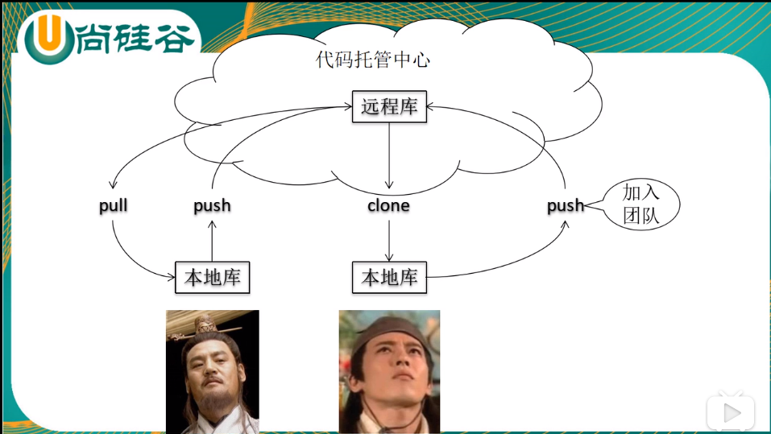 

#### 跨团队协作

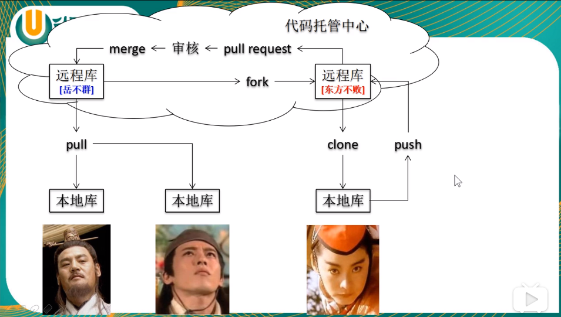

#### Git命令行操作

##### 本地库初始化

> git init 初始化为Git  （创建.git 隐藏目录）


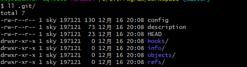

#### **设置签名**

- 主要目的区分开发人员身份

形式

> userName:sky email:45512@qq.com

辨析：这里设置的签名和远程库（代码托管执行）的账号、密码一点关系没有(只是为了区别开发人员身份)。

命令：

##### 1.项目级别/仓库级别

- 仅在当前本地库范围内有效

> **git config**
>
> git config user.name sky_pr
>
> git config user.email 45512_pro@qq.com

信息保存位置(.git/config)：

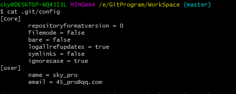

#####  2.系统用户级别

- ##### 登录当前操作系统的用户范围内有效

> **git config --global**
>
> git config --global user.name sky_glb
>
> git config --global user.email 45512_glb@qq.com 

保存位置(cd ~  .gitconfig)

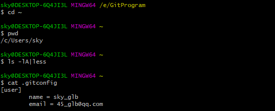

##### 3.优先级：

就近原则，项目级别优先级高于系统用户级别，两者都存在时，采用项目级别的签名。 如果只有系统用户级别的签名，就以系统用户级别签名为准。两者签名都没有是不允许的。

> **git status**


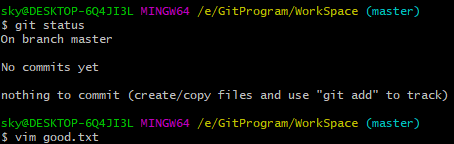


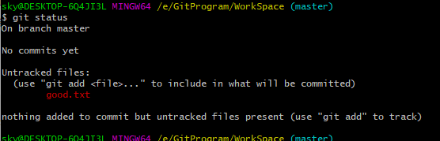

> On branch master :当前所在的分支（master 主分支）
>
> No commits yet ： 当前没有提交的文件（是指暂存区没有向本地库提交）
>
> nothing to commit :工作区没有什么文件可以向暂存区提交的
>
> untracked files: 未追踪的文件（是指为被git管理的文件）

将文件提交到暂存区

> **git add**


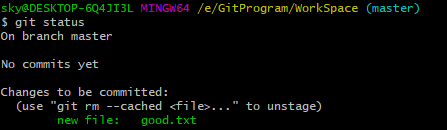

> git rm --cached <file> 从暂存区删除文件

> git commit good.txt 提交暂存区文件
>
> git commit -m "第二次修改" good.txt 提交暂存区文件

**总结**

> **git status 查看工作区、暂存区、本地库状态**
>
> **git add  将工作区的 "新建/修改" 添加到暂存区**
>
> **git commit -m "message"  将暂存区的内容提交到本地库**


##### 查看历史记录

> git log
>
> git log --pretty=oneline
>
> git log --oneline
>
> git reflog

##### 前进后退操作

***HEAD 是历史记录的指针***

前进或回退到指定版本

基于索引值操作【推荐】

> git reset --hard [head索引值] 

基于^操作 只能后退

> git reset --hard HEAD^^^^

基于~操作 只能后退

> git reset --hard HEAD~4

> git help reset 

> **git reset --soft [..]  只修改本地库
> **
>
> **git reset --mixd [..] 修改本地库和暂存区
> **
>
> **git reset --hard [..] 修改本地库、暂存区、工作区**

### 

### Git 常用操作命令收集：

#### 1) 远程仓库相关命令

检出仓库：$ **git** clone **git**://github.com/jquery/jquery.**git**

查看远程仓库：$ **git** remote -v

添加远程仓库：$ **git** remote add [name] [url]

删除远程仓库：$ **git** remote rm [name]

修改远程仓库：$ **git** remote set-url --**push**[name][newUrl]

拉取远程仓库：$ **git** pull [remoteName] [localBranchName]

推送远程仓库：$ **git push** [remoteName] [localBranchName]

 

#### 2）分支(branch)操作相关命令

查看本地分支：$ **git** branch

查看远程分支：$ **git** branch -r

创建本地分支：$ **git** branch [name] ----注意新分支创建后不会自动切换为当前分支

切换分支：$ **git** checkout [name]

创建新分支并立即切换到新分支：$ **git** checkout -b [name]

删除分支：$ **git** branch -d [name] ---- -d选项只能删除已经参与了合并的分支，对于未有合并的分支是无法删除的。如果想强制删除一个分支，可以使用-D选项

合并分支：$ **git** merge [name] ----将名称为[name]的分支与当前分支合并

创建远程分支(本地分支**push**到远程)：$ **git push** origin [name]

删除远程分支：$ **git push** origin :heads/[name]

我从master分支创建了一个issue5560分支，做了一些修改后，使用**git push** origin master提交，但是显示的结果却是'Everything up-to-date'，发生问题的原因是**git push** origin master 在没有track远程分支的本地分支中默认提交的master分支，因为master分支默认指向了origin master 分支，这里要使用**git push** origin issue5560：master 就可以把issue5560推送到远程的master分支了。

   如果想把本地的某个分支test提交到远程仓库，并作为远程仓库的master分支，或者作为另外一个名叫test的分支，那么可以这么做。
$ origin test:master     // 提交本地test分支作为远程的master分支 //好像只写这一句，远程的github就会自动创建一个test分支$ origin test:test       // 提交本地test分支作为远程的test分支

$ origin :test       // 刚提交到远程的test将被删除，但是本地还会保存的，不用担心

#### 3）版本(tag)操作相关命令

查看版本：$ **git** tag

创建版本：$ **git** tag [name]

删除版本：$ **git** tag -d [name]

查看远程版本：$ **git** tag -r

创建远程版本(本地版本**push**到远程)：$ **git push** origin [name]

删除远程版本：$ **git push** origin :refs/tags/[name]

 

#### 4) 子模块(submodule)相关操作命令

添加子模块：$ **git** submodule add [url] [path]

如：$ **git** submodule add **git**://github.com/soberh/ui-libs.**git** src/main/webapp/ui-libs

初始化子模块：$ **git** submodule init ----只在首次检出仓库时运行一次就行

更新子模块：$ **git** submodule update ----每次更新或切换分支后都需要运行一下

删除子模块：（分4步走哦）

1)$ **git** rm --cached [path]

2) 编辑“.gitmodules”文件，将子模块的相关配置节点删除掉

3) 编辑“.**git**/config”文件，将子模块的相关配置节点删除掉

4) 手动删除子模块残留的目录

 

#### 5）忽略一些文件、文件夹不提交

在仓库根目录下创建名称为“.gitignore”的文件，写入不需要的文件夹名或文件，每个元素占一行即可，如

target

bin

*.db

### SSH秘钥连接Githug

[使用SSH密钥连接Github]: https://www.xuanfengge.com/using-ssh-key-link-github-photo-tour.html
[GitHub如何配置SSH Key]: https://blog.csdn.net/u013778905/article/details/83501204


#### 设置git的user name和email

```cmake
git config --global user.name "Luke.Deng"
git config --global user.email  "xiangshuo1992@gmail.com"
```

#### 检查是否存在SSH Key

```cmake
cd ~/.ssh
ls
或者
ll
看是否存在 id_rsa 和 id_rsa.pub文件，如果存在，说明已经有SSH Key
```

#### 创建一对新的SSH密钥

```cmake
$ssh-keygen -t rsa -C "your_email@example.com"
#这将按照你提供的邮箱地址，创建一对密钥
Generating public/private rsa key pair.
Enter file in which to save the key (/c/Users/you/.ssh/id_rsa): [Press enter]
```

> 直接回车，则将密钥按默认文件进行存储。此时也可以输入特定的文件名，比如/c/Users/you/.ssh/github_rsa;接着，根据提示，你需要输入密码和确认密码（说到这里，如果你很放心，其实可以不用密码，就是到输密码的地方，都直接回车，所以每次push就只管回车就行了。所谓的最安全的密码，就是没有密码  – –  哈哈）

#### 在GitHub账户中添加你的公钥

 id_rsa.pub 

#### 测试

> 为了确认我们可以通过SSH连接GitHub，我们输入下面命令。输入后，会要求我们提供验证密码，输入之前创建的密码就ok了。 

```cmake
$ssh -T git@github.com
```

 你可能会看到告警信息，如下： 

```cmake
The authenticity of host 'github.com (207.97.227.239)' can't be established.
RSA key fingerprint is 16:27:ac:a5:76:28:2d:36:63:1b:56:4d:eb:df:a6:48.
Are you sure you want to continue connecting (yes/no)?
```

不用担心，直接输入yes。

如果看到下面信息，就说明一切完美！

Hi username! You’ve successfully authenticated, but GitHub does not provide shell access.


### 高频使用的Git命令

#### git log

查看日志，常规操作，必备 

```cmake
# 输出概要日志,这条命令等同于
# git log --pretty=oneline --abbrev-commit
git log --oneline

# 指定最近几个提交可以带上 - + 数字
git log --oneline -5
```

#### git status

 查看工作区状态 

```cmake
# 等同 git status --long,查看当前工作区暂存区变动
git status

# 概要信息 (--short)
git status -s

# 查询工作区中是否有stash存在（暂存的东西）,有则提醒该工作区有几个 stash
git status  --show-stash
```

#### git checkout

用来切换到对应记录的,可以基于分支,提交,标签。

切提交和标签一般用来热修复或者老版本需要加新特性。

```cmake
# 分支切换
git checkout dev # local branch

# 切换远程分支
git checkout origin/test # remote branch

# 基于远程分支创建本地分支，并跟踪对应来自 'origin' 的远程分支
git checkout --track origin/feature-test # new local branch wih remote branch

# 基于本地分支开出新分支
git checkout -b testbranch # new local branch with current branch

# 彻底丢弃某个文件的改动
git checkout -- file

# 放弃本地所有改动
git checkout .

# 切换上一个分支
git checkout -
```

#### git commit

```cmake
# 新修改的内容,添加到上次提交中,减少提交的日志
# --no-edit:是跳过进入编辑器，直接提交
# git commit --amend这条命令等同于
# $ git reset --soft HEAD^
# $ ... do something  tree ...
# $ git commit -c ORIG_HEAD
git commit --amend --no-edit

# 跳过校验直接提交,包括任何 githooks
git commit --no-verify -m "xxx"

# 带提交概要信息
git commit -m "xxx"

# 指定目录格式提交
# -t <file>, --template=<file>
# 也可以从全局或者项目级别指定提交的模板文件
# git config [--global] commit.template xxx
# 现在一般都是 用社区的npm规范包，commitizen 和 commitlint 来规范提交
git commit -t templateFile

# 提交信息从文件读取,可以结合上面的一起用
git commit -F
```

#### git reset

-  代码回滚中这个命令也是用的很多，而且是 `--hard` 

```cmake
# 硬性回滚,简单粗暴，直接抛弃回滚之后改动(log 还是有保留，内容不要而已)
git reset --hard commit_sha1

# 软性回滚, 跟 rebase 常规用法差不多的效果，可以把提交的东西丢回暂存区和工作区，
# HEAD 的指向改变会对应的 commit,之后再考虑怎么 commit
git reset --soft commit_sha1

# 软回滚一个版本,可以理解为撤销最近一次的 commit
git reset --soft HEAD~1

# 清除暂存区但保留工作区变动。
git reset --mixed commit_sha1

# 保留工作区和暂存区之间的差异。
git reset --merge commit_sha1

# 保留工作区和HEAD之间的差异
git reset --keep commit_sha1
```

#### git revert

一般用于master 的代码回滚，因为多人在上面协作，

`revert` 可以平稳的回滚代码,但却保留提交记录,不会让协作的人各种冲突！

```cmake
# 回滚到某个 commit
git revert commit-sha1
```


#### git rebase

变基在项目中算是很频繁的，为什么这么说。

比如你开发一个新的 feature, 遵循最小化代码提交的理念。

在整个功能开发完毕的时侯，会有非常多的 commit，用 `rebase` 可以让我们的commit记录很干净

```cmake
# 带 -i 可以进入交互模式，效果如下
git rebase -i git-sha1|branch(HEAD)

# 若是中间毫无冲突，变基则一步到位，否则需要逐步调整。
git rebase --continue # 提交变更后继续变基下一步
git rebase --skip # 引起冲突的commits会被丢弃，continue提示没有需要改动的也可以用这个跳过
git rebase --abort # 若是变基改残废了，但是走到一半，可以彻底回滚变基之前的状态
```

- pick: 是保留该 commit(采用)
- edit: 一般你提交的东西多了,可以用这个把东东拿回工作区拆分更细的 commit
- reword: 这个可以重新修改你的 commit msg
- squash: 内容保留，把提交信息往上一个 commit 合并进去
- fixup: 保留变动内容，但是抛弃 commit msg
- drop: 用的比较少，无用的改动你会提交么！！！

**温馨提示：**

- 本地提交之前，最好把基准点变为需要合并的分支，这样提交 PR/MR 的时侯就不会冲突(本地来解决冲突)
- 不要在公共分支上变基！！！一变其他协作者基本都一堆冲突！除非你们有很清晰的分支管理机制

#### git merge

```cmake
# --ff 是指fast-forward命令,当使用ff模式进行合并时，将不会创造一个新的commit节点。
# --no-ff,保留合并分支的提交记录,一般主干用的比较多.
# --ff-only 除非当前HEAD节点为最新节点或者能够用ff模式进行合并，否则拒绝合并并返回一个失败状态。
# --squash 则类似 rebase squash,可以把合并多个 commit 变成一个
git merge --no-ff branchName
```


#### git pull

`git pull`中用的最多是带`--rebase(-r)`的方式(变基形式拉取合并代码),保持分支一条线。

默认的`pull`会走`ff`模式,多数情况会产生新的commit,部分参数与 `merge`提供一致。


#### git push

当本地分支存在，远程分支不存在的时侯，可以这样推送关联的远程分支

```cmake
# 这样会直接新建一个同名的远程分支
git push origin localbranch 


# 删除远程分支(--delete)
git push -d origin branchName

# 推送所有标签
git push --tags

# 推送 commit 关联的 tags
git push --follow-tags

# 强制推送(--force)
git push -f origin branchName # 一般合理的项目，主干都做了分支保护,不会允许强推行为

# 有时候真的需要强推的时侯,但可不可以柔和一点呢？
# 就是当前远程分支和你本地一致,没有别人提交的情况下可以强推
# --force-with-lease: 若是远程有人提交，此次强推失败，反之成功
git push --force-with-lease
```


#### git remote

这个东西用在你需要考虑维护多个地方仓库的时侯会考虑，或者修改仓库源的时侯

```cmake
# 常规关联本地 git init 到远程仓库的姿势
git remote add origin url

# 新增其他上游仓
git remote add github url

# 修改推送源
git remote set-url  origin(或者其他上游域) url
```


#### git branch

该命令用的最多的就是删除本地分支，重命名分支，删除远程分支了

```cmake
# 分支删除，拷贝，重命名，参数若是大写就等同多了--force，强制执行
# -c, --copy : 复制分支，
# -C：等同于 --copy --force
# -d, --delete: 删除分支
# -m, --move：移动或者重命名分支
git branch -d branchName
git branch -M oldBranch newNameBranch


# 手动指定它的当前分支的上游分支,两个写法一致的
# 有关联一般也有取消关联，--unset-upstream
git branch --set-upstream-to=origin/xxx 
git branch --set-upstream-to origin xxx 
```


#### git stash

暂存用的最多时侯就是你撸代码撸到一半，突然说有个紧急 BUG 要修正。

或者别人在你这里需要帮忙排查代码，你这时候也会用到。

强烈建议给每个 `stash` 添加描述信息！！！

```cmake
# 缓存当前工作区的内容到stashName, save 这个现在不怎么推荐用，图方便也能用
# -a|--all: 除了未跟踪的文件，其他变动的文件都会保存
# -u|--include-untracked：包括没有添加到暂存区的文件
git stash save stashName
git stash -u save stashName

# 现在基本推荐用 push,因为有 pop，语义上和维护上更清晰
# 上面有的参数，它也有，还有-m 来备注这个 stash 的大概情况
git stash push -m "更改了 xx" 

# 有保存那肯定也有取用的
# pop: 取会删除对应的保存记录
# apply: 取但保留记录
# 0就是--index,这个东西哪里来的呢？
git stash apply stash@{0}
git stash pop stash@{0}

# 查看stash 保存记录
# eg: stash@{0}: On dev: 测试
git stash list


# 只想删除暂存记录怎么办：
# clear : 清空所有 stash
# drop: 清除指定的 stash
git stash clear # 慎用！
git stash drop stash@{0}

# 想看 stash 做了什么改动，类似简化版的git diff
git stash show stash@{0}
```


#### git reflog

这个命令的强大之处，是记录了所有行为，包括你 `rebase,merge, reset` 这些

当我们不小心硬回滚的时侯,或变基错了都可以在这里找到行为之前的commit，然后回滚。

当然这个时间回溯也只在本地有用，你推送到远程分支的破坏性改动,该凉还是得凉。

```cmake
# 最近五次行为,不带-n 则默认所有
git reflog -5
```


#### git cherry-pick

这个东西你可以理解为你去买橘子，你会专门挑一些符合心意的橘子放到购物篮中。

你可以从多个分支同时挑取部分需要的 commit 合并到同一个地方去，是不是贼骚。

这货和变基有点类似，但是仅仅类似，挑过来的 commit 若是没有冲突则追加。

有冲突会中断，解决后 `--continue`

```cmake
# 在当前分支挑其他分支的 commit，把那部分的变动那过来
git cherry-pick commit-sha1

# 支持一次性拿多个
git cherry-pick master~4 master~2

# 支持区间, 区间中间是 .. 
git cherry-pick startGitSha1..endGitSha1

# --continue：继续 pick,一般有冲突解决后才需要这样
# --skip：跳过这次进入队列下一次行为 
# --abort : 完全放弃 pick，恢复 pick 之前的状态
# --quit: 未冲突的自动变更，冲突的不要，退出这次 pick
# 这几个状态跟变基差不多,解决冲突继续，跳过处理，放弃这次pick,不输出错误
```


#### git rm

这个命令在旧的版本用的比较最多的姿势是为了重新索引.gitignore 的范围

```cmake
# 删除某个文件的索引
# --cache 不会删除硬盘中的文件，只是 git 索引(缓存)的关系！！！
git rm --cache -- file

# 递归清除全部所有索引(也可以理解为缓存吧),这个姿势适合重新让.gitignore 新范围生效
git rm -r --cached .  
git add .
git commit -m "xxx"
```

#### git rev-parse

这个估计一般人用的不是很多，可以通过这个快速获取部分git 仓库的信息

我在弄脚本的时侯就会从这里拿东西

```cmake
# 获取最新有效的commit
# --short：显示七位的 sha1,不带就是全部
# --verify: 校验是否有效commit
# HEAD: 当前分支的head 指向
git rev-parse --short HEAD --verify

# 显示仓库的绝对路径
git rev-parse --show-toplevel #eg: /Users/linqunhe/Code/aozhe/thinking-ui

# 显示版本库.git 目录所在的位置
git rev-parse --git-dir

# 显示所有关联引用的 git sha1
git rev-parse --all
```

#### git diff

对于这个命令，在终端比对用的不是很频繁，除了少量改动的时侯可能会用这个看看。

其他情况下我更倾向于用 GUI 工具来看，因为比对更加直观。


### git中产生冲突的原因

1. master

```cmake
111
bug code
```

2. 切出功能分支test，此时内容保持不变。同时开发了一点新的功能 

```cmake
111
bug code
new code int test
```

3. 此时发现：master上的代码有bug，紧急修复了bug

```cmake
111
fix code in maste
```

4.  合并test分支到master，这个时候就会出现冲突 

```
111
<<<<<<< HEAD
fix code in master
=======
bug codenew code int test
>>>>>>> test
```

 出现冲突的原因就是：2行都有修改，合并test时，git不知道你想要哪个 

#### 分析

**多个分支对同一分支上的相同地方进行了修改，而双方没有约定，所以避免冲突的方式，就是及时对代码pull，或者约定一方先进行修改并提交，另一方，再进行pull。**

### Fast Forward 和 no fast foward

 下图利用Fast-forward将dev合并到master ： 

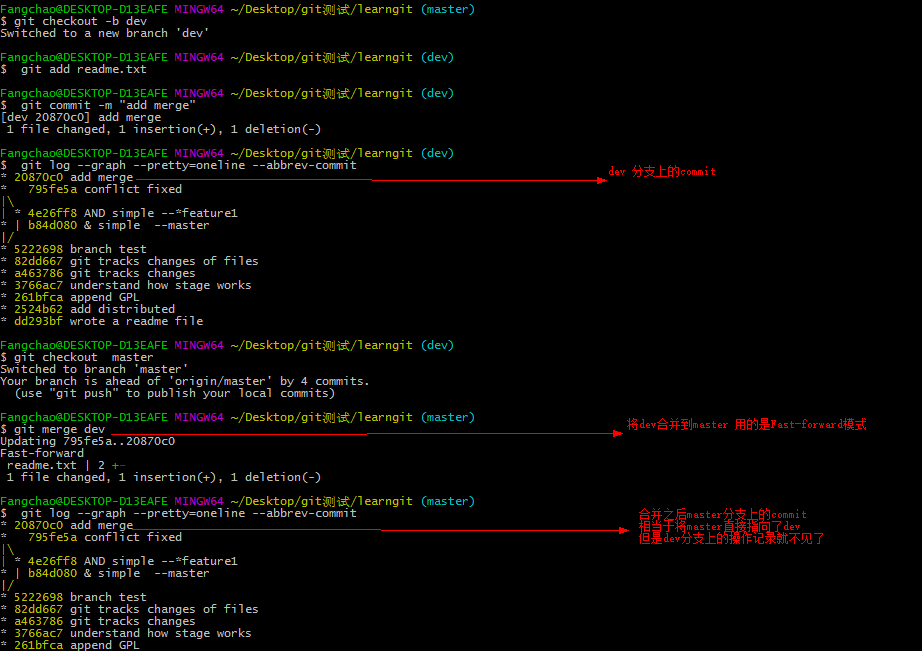

下图没有使用Fast-forward模式 ，可以看出，使用no-ff后，会多生成一个commit 记录，并强制保留develop分支的开发记录（而fast-forward的话则是直接合并，看不出之前Branch的任何记录）

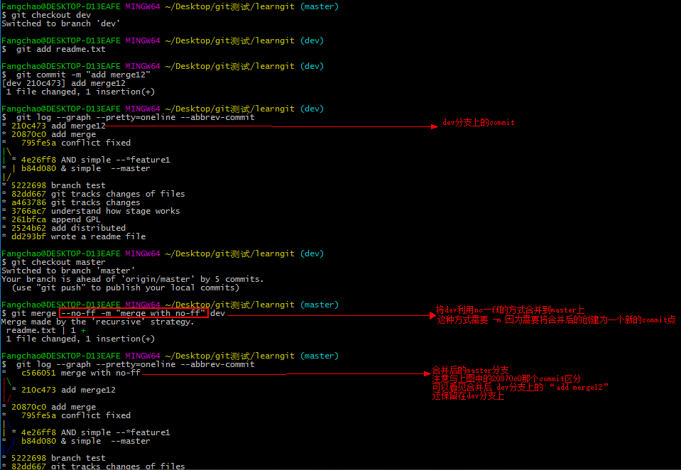

--no-ff 指的是强行关闭fast-forward方式。--no-ff (no fast foward)，使得每一次的合并都创建一个新的commit记录，即要求git merge即使在fast forward条件下也要产生一个新的merge commit，用来避免丢失信息。这对于以后代码进行分析特别有用。

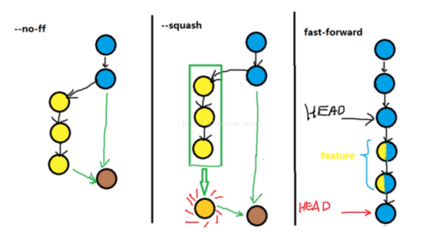